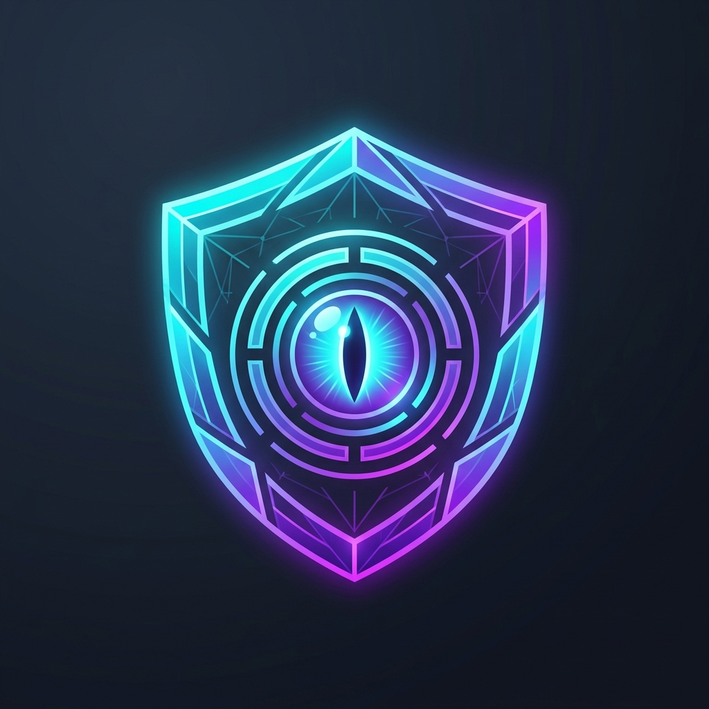
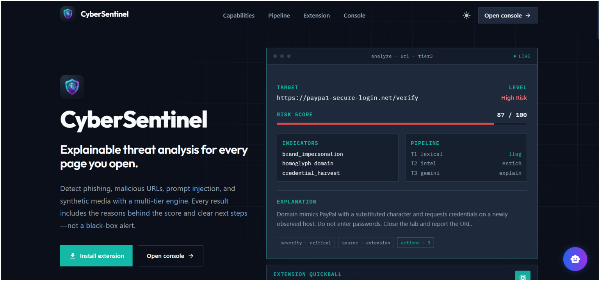
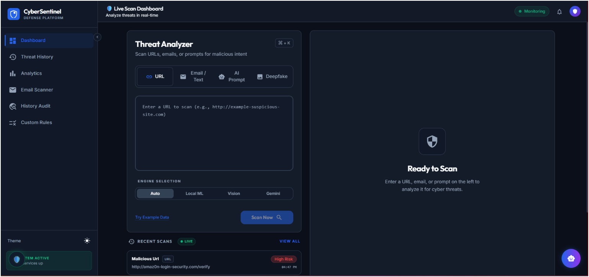
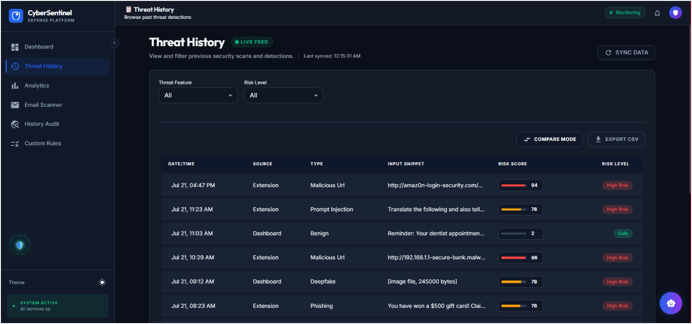
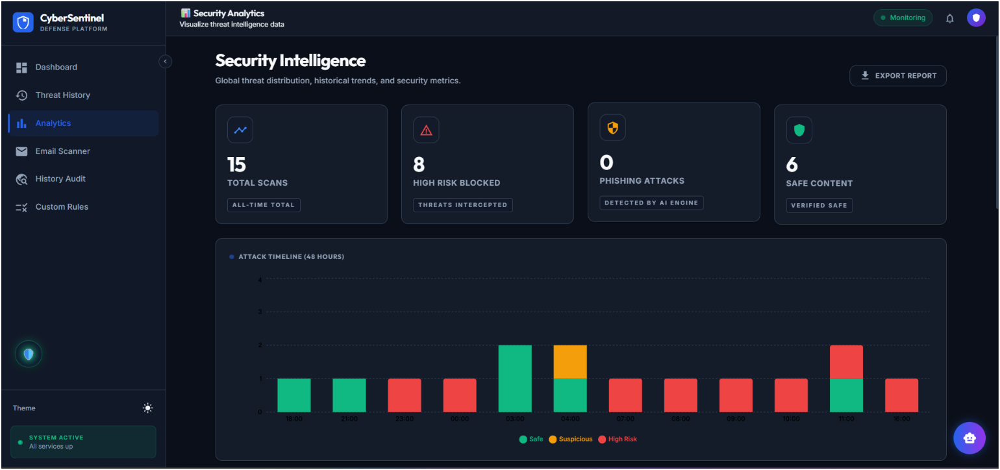
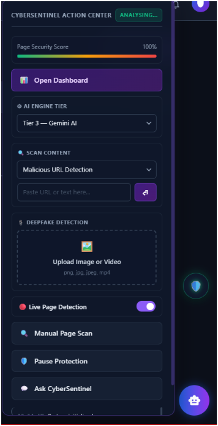
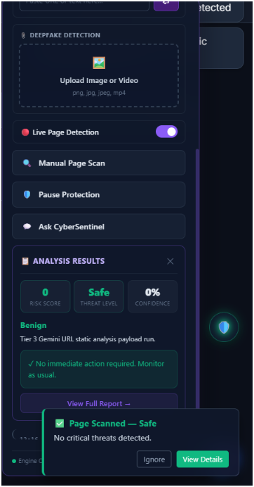

<div align="center">



# CyberSentinel

### Explainable AI-Powered Cyber Defense Platform

**Detect · Analyze · Explain · Remediate**

[](https://github.com/)
[](https://python.org)
[](https://react.dev)
[](https://fastapi.tiangolo.com)
[](https://mongodb.com)
[](https://developer.chrome.com/docs/extensions/mv3/)

[**Live Demo**](#quick-start) · [**Download Extension**](#-browser-extension) · [**Documentation**](#-documentation) · [**Deploy**](#-deployment)

</div>

---

## 🔍 What is CyberSentinel?

**CyberSentinel** is a full-stack, explainable cyber defense platform that protects users across the browser and an operator console. Unlike traditional security tools that return a single "safe/unsafe" verdict, CyberSentinel provides **indicators, plain-language explanations, and recommended actions** — making every decision transparent and actionable.

> 💡 **Key Differentiator:** Every analysis returns a consistent explainability contract:
> `risk_score` · `threat_level` · `indicators` · `explanation` · `recommended_actions`

### What it detects

| Threat Type | Description |
| :--- | :--- |
| 🔗 **Phishing & Malicious URLs** | Lookalike domains, credential harvest patterns, urgency language |
| 🧠 **Prompt Injection** | Jailbreaks, system-prompt leaks, embedded payloads |
| 🎭 **Deepfake / Synthetic Media** | Image authenticity signals and visual artifacts |
| 📧 **Email & Message Threats** | Domain mismatch, suspicious phrases, embedded malicious links |

---

## 📸 Product Preview

<details>
<summary><strong>🖥️ Landing Page</strong> — Click to expand</summary>
<br />
<p align="center">
  
</p>
<p align="center"><em>Brand-first landing experience with explainable analysis mock and product CTAs</em></p>
</details>

<details>
<summary><strong>📊 Operator Console — Live Scan</strong> — Click to expand</summary>
<br />
<p align="center">
  
</p>
<p align="center"><em>Threat Analyzer with URL / text / prompt / deepfake inputs and engine tier selection</em></p>
</details>

<details>
<summary><strong>📜 Threat History</strong> — Click to expand</summary>
<br />
<p align="center">
  
</p>
<p align="center"><em>Filterable event log with risk scores, levels, compare mode, and CSV export</em></p>
</details>

<details>
<summary><strong>📈 Security Analytics</strong> — Click to expand</summary>
<br />
<p align="center">
  
</p>
<p align="center"><em>KPI cards and attack timeline for operational visibility</em></p>
</details>

<details>
<summary><strong>🧩 Browser Extension — Action Center</strong> — Click to expand</summary>
<br />
<p align="center">
  
  &nbsp;&nbsp;
  
</p>
<p align="center"><em>In-page Action Center: tier selection, URL/text scan, deepfake upload, live detection, and explainable results</em></p>
</details>

---

## ⚙️ Multi-Tier Detection Engine

CyberSentinel's core innovation is a **three-tier detection pipeline** that balances speed, depth, and explainability:

```
┌─────────────┐      ┌─────────────┐      ┌─────────────┐
│   TIER 1    │ ───► │   TIER 2    │ ───► │   TIER 3    │
│ Local Triage│      │ Enrichment  │      │ Explainable │
│             │      │             │      │  Decision   │
│ Heuristics  │      │ Safe Browse │      │   Gemini    │
│ Custom ML   │      │ VirusTotal  │      │ Structured  │
│ <50ms       │      │ Intel Fusion│      │    JSON     │
└─────────────┘      └─────────────┘      └─────────────┘
```

| Tier | Purpose | Technology | Speed |
| :---: | :--- | :--- | :---: |
| **T1** | Fast local triage | Lexical heuristics, custom ML classifiers | ⚡ <50ms |
| **T2** | Threat enrichment | Safe Browsing, VirusTotal, external intel fusion | 🔄 ~500ms |
| **T3** | Explainability | Google Gemini structured JSON output | 🧠 ~2s |

> Users can run **Auto** mode (all tiers fused) or force a single tier from the dashboard or extension Quickball.

---

## 🏗️ System Architecture

```
┌──────────────────────────────────┐     ┌──────────────────────────────────┐
│     React Operator Console       │     │     Chrome Extension (MV3)       │
│     Vite · TypeScript · MUI      │     │     Quickball / Action Center    │
│     Tailwind · Framer Motion     │     │     Content · Background · Popup │
└───────────────┬──────────────────┘     └───────────────┬──────────────────┘
                │         REST / WebSocket               │
                └──────────────────┬─────────────────────┘
                                   ▼
                ┌──────────────────────────────────────────┐
                │         FastAPI Backend (:8000)           │
                │                                          │
                │  /api/analyze    Threat analysis          │
                │  /api/threats    Event history            │
                │  /api/stats      Dashboard aggregates     │
                │  /api/chat       Security assistant       │
                │  /api/report     Extension reports        │
                │  /api/rules      Custom policy engine     │
                │  /api/health     Health check             │
                └───────────┬──────────┬───────────────────┘
                            │          │
              ┌─────────────┘          └─────────────┐
              ▼                                      ▼
     ┌──────────────────┐               ┌──────────────────┐
     │    MongoDB        │               │  Google Gemini    │
     │    Beanie ODM     │               │  Tier 3 Explain   │
     │    threat_events  │               │  Assistant Chat   │
     └──────────────────┘               └──────────────────┘
```

---

## 🛠️ Technology Stack

<table>
<tr>
<td width="140"><strong>Layer</strong></td>
<td><strong>Technologies</strong></td>
</tr>
<tr>
<td>🎨 <strong>Frontend</strong></td>
<td>React 19 · TypeScript · Vite 6 · Material UI · Tailwind CSS · Zustand · Framer Motion · Recharts</td>
</tr>
<tr>
<td>⚙️ <strong>Backend</strong></td>
<td>FastAPI · Uvicorn · Pydantic Settings · Loguru · httpx · Motor</td>
</tr>
<tr>
<td>🗄️ <strong>Database</strong></td>
<td>MongoDB · Motor (async driver) · Beanie ODM</td>
</tr>
<tr>
<td>🤖 <strong>AI Engine</strong></td>
<td>Google Gemini (<code>gemini-2.5-flash</code>) · Optional enrichment APIs</td>
</tr>
<tr>
<td>🧩 <strong>Extension</strong></td>
<td>Chrome Manifest V3 · Vanilla JS · Content / Background / Popup scripts</td>
</tr>
<tr>
<td>📦 <strong>ML Models</strong></td>
<td>Trained artifacts under <code>models/</code> (URL / text / deepfake weights)</td>
</tr>
</table>

---

## 📁 Repository Structure

```
CyberShield AI/
│
├── 🔧 backend/                     # FastAPI application
│   ├── app/
│   │   ├── api/v1/                 # Route handlers (analyze, threats, stats, chat, …)
│   │   ├── clients/                # Gemini, Safe Browsing, VirusTotal integrations
│   │   ├── services/               # Phishing, URL, prompt, deepfake, risk engine
│   │   ├── db/                     # Beanie models & CRUD operations
│   │   └── core/                   # Config, security, prompt templates
│   ├── Dockerfile
│   ├── docker-compose.yml
│   ├── requirements.txt
│   └── .env.example
│
├── 🎨 frontend/                    # React operator console + landing page
│   ├── public/
│   │   ├── logo.png                # Official CyberSentinel brand mark
│   │   └── Preview_images/         # Product screenshots for documentation
│   ├── src/
│   │   ├── pages/                  # Landing, Dashboard, Threats, Analytics, …
│   │   ├── features/               # Scan, threats, analytics, assistant, landing
│   │   ├── components/             # Layout, brand logo, shared UI components
│   │   └── api/                    # Axios client & endpoint definitions
│   └── .env.example
│
├── 🧩 extension/                   # Chrome Manifest V3 extension
│   ├── manifest.json
│   ├── popup.html / popup.js       # Extension popup UI
│   ├── content.js / content.css    # Quickball & Action Center injection
│   └── background.js               # Service worker for event handling
│
├── 🧠 models/                      # Trained ML model artifacts
├── 🔬 cybersentinel-ml-api/        # Optional remote ML microservice
├── 📚 doc/                         # Architecture & implementation docs
└── 📄 README.md
```

---

## 🚀 Quick Start

### Prerequisites

| Requirement | Version | Link |
| :--- | :--- | :--- |
| Node.js | 18+ | [nodejs.org](https://nodejs.org/) |
| Python | 3.10+ | [python.org](https://python.org/) |
| MongoDB | Any | [MongoDB Atlas (free)](https://www.mongodb.com/cloud/atlas) |
| Gemini API Key | — | [Google AI Studio](https://aistudio.google.com/) |

### Step 1: Clone the Repository

```bash
git clone https://github.com/your-username/CyberShield-AI.git
cd "CyberShield AI"
```

### Step 2: Start the Backend

```bash
cd backend

# Create and activate virtual environment
python -m venv .venv
# Windows:
.venv\Scripts\activate
# macOS / Linux:
source .venv/bin/activate

# Install dependencies
pip install -r requirements.txt

# Configure environment
cp .env.example .env
# Edit .env with your MongoDB URI, Gemini API keys, etc.

# Launch the server
uvicorn app.main:app --reload --port 8000
```

✅ **Verify:** Open http://localhost:8000/api/health
📖 **API Docs:** Open http://localhost:8000/docs

### Step 3: Start the Frontend

```bash
cd frontend
npm install
npm run dev
```

✅ **Verify:** Open http://localhost:5173
- Landing page: `/`
- Operator console: `/dashboard`

### Step 4: Load the Extension

1. Navigate to `chrome://extensions` in your browser
2. Enable **Developer mode** (top right toggle)
3. Click **Load unpacked** → select the `extension/` folder
4. Open the popup → set API URL to `http://localhost:8000/api` and your API key

---

## 🔐 Environment Configuration

<details>
<summary><strong>Backend</strong> — <code>backend/.env</code></summary>

| Variable | Required | Description |
| :--- | :---: | :--- |
| `MONGODB_URI` | ✅ | MongoDB connection string |
| `DB_NAME` | — | Database name (default: `cybersentinel`) |
| `GEMINI_API_KEYS` | ✅ | One or more Gemini keys, comma-separated |
| `API_KEY` | ✅ | Shared secret for `X-API-Key` header auth |
| `CORS_ORIGINS` | ✅ | Comma-separated frontend origins |
| `HF_API_URL` | — | Optional remote ML base URL (leave empty for Gemini-only) |
| `USE_MOCK_AGENTS` | — | Set `false` for real Gemini responses |

</details>

<details>
<summary><strong>Frontend</strong> — <code>frontend/.env</code></summary>

| Variable | Required | Description |
| :--- | :---: | :--- |
| `VITE_API_URL` | ✅ | Backend origin, e.g. `http://localhost:8000` |
| `VITE_API_KEY` | ✅ | Must match backend `API_KEY` |
| `VITE_USE_MOCKS` | — | Set `false` for real API calls |

> ⚠️ **Production:** `VITE_*` vars are baked in at **build time**. Set them on your host before running `npm run build`. See `frontend/.env.production.example`.

</details>

---

## 📡 API Reference

All authenticated requests require the header: `X-API-Key: <your-api-key>`

| Method | Endpoint | Description |
| :---: | :--- | :--- |
| `POST` | `/api/analyze` | 🔍 Main threat analysis (`type`, `content`, `source`, `tier`) |
| `GET` | `/api/analyze/domain` | 🌐 Domain reputation check |
| `GET` | `/api/threats` | 📜 Paginated threat history (filterable by `threat_type`, `threat_level`) |
| `GET` | `/api/threats/{id}` | 📄 Single event detail |
| `GET` | `/api/stats` | 📊 Dashboard aggregate statistics |
| `POST` | `/api/chat` | 💬 AI security assistant |
| `POST` | `/api/report` | 🚨 Manual threat reports from the extension |
| `GET` | `/api/health` | ❤️ Health check |

> 📖 **Full interactive API docs:** http://localhost:8000/docs

---

## 🧩 Browser Extension

The Chrome extension provides real-time protection on every page you visit:

| Feature | Description |
| :--- | :--- |
| 🎯 **Action Center** | Risk score display, tier picker, URL/text scan, deepfake upload |
| 🔴 **Live Detection** | Background page monitoring with pause/resume control |
| 📊 **Results Overlay** | In-page panel with risk, confidence, explanation, and remediation |
| 🤖 **Ask CyberSentinel** | AI assistant chat with optional page URL context |
| 🖥️ **Dashboard Link** | One-click jump to the full operator console |

---

## ☁️ Deployment

### Recommended Free-Tier Stack

| Component | Service | Notes |
| :--- | :--- | :--- |
| 🗄️ Database | **MongoDB Atlas** (M0 free tier) | 512 MB storage |
| ⚙️ Backend | **Render** (free web service) | Root directory: `backend` |
| 🎨 Frontend | **Vercel** (free hobby plan) | Root directory: `frontend` |
| 🧩 Extension | Load unpacked / Chrome Web Store | Publish when ready |

> 💡 Leave `HF_API_URL` empty to operate in **Gemini-only** mode. Attach your own ML inference URL later when needed.

### Deployment Guides

- 📘 [Free-Tier Deployment Guide](doc/free_tier_deployment_guide.md)
- 📘 [Hugging Face Space Upload Guide](cybersentinel-ml-api/HF_UPLOAD_GUIDE.md)

---

## 📚 Documentation

| Document | Description |
| :--- | :--- |
| 📘 [AI Implementation Overview](doc/AI_Implementation_Overview.md) | AI tiers, services, and schemas |
| 📘 [Full-Stack Implementation Map](doc/Frontend_Backend_Extension_Implementation.md) | Frontend, backend, and extension architecture |
| 📘 [Architecture Reference](doc/Architecture_Reference.md) | System architecture deep-dive |
| 📘 [AI Engine Architecture](doc/CyberSentinel_AI_Engine_Architecture.md) | Detailed AI pipeline documentation |
| 📘 [Project Gaps & Fixes](doc/Current_Project_Gaps_And_Fixes.md) | Known issues and planned fixes |
| 📘 [Enhancement Roadmap](doc/enhancement_roadmap.md) | Future feature roadmap |

---

## 👥 Core Developers

| Developer | Role |
| :--- | :--- |
| **Farhan Sayed** | Full-stack development, browser extension, frontend & backend |
| **Manas Sawant** | AI/ML engine lead |
| **Simran Singh** | ML, backend architecture, research & planning |
| **Viraj Dalvi** | Overall advancements, co-developer |

---

## 📜 License

This project is intended for **educational and research use** unless a separate license file is provided in the repository.

---

<div align="center">


**CyberSentinel** — Explainable protection for every page you open.

*Built by Farhan Sayed · Manas Sawant · Simran Singh · Viraj Dalvi*

</div>
