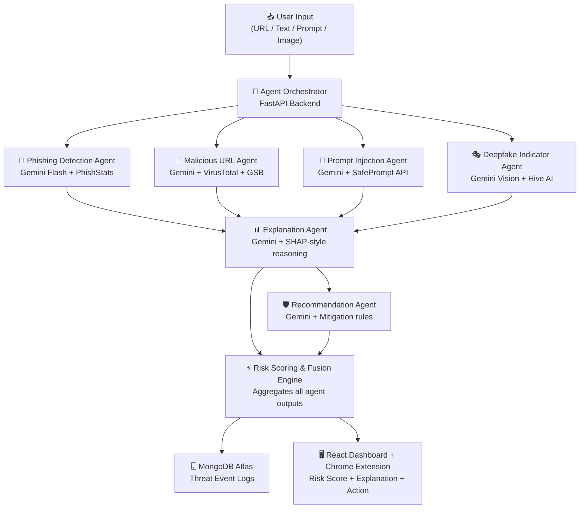
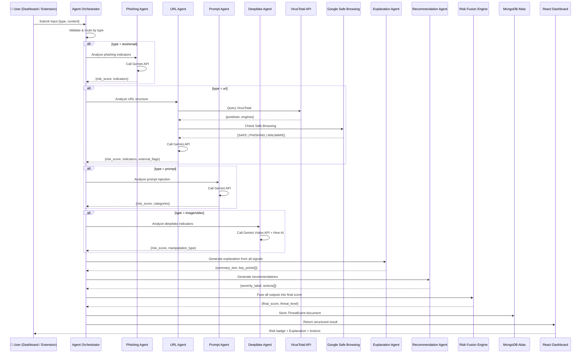
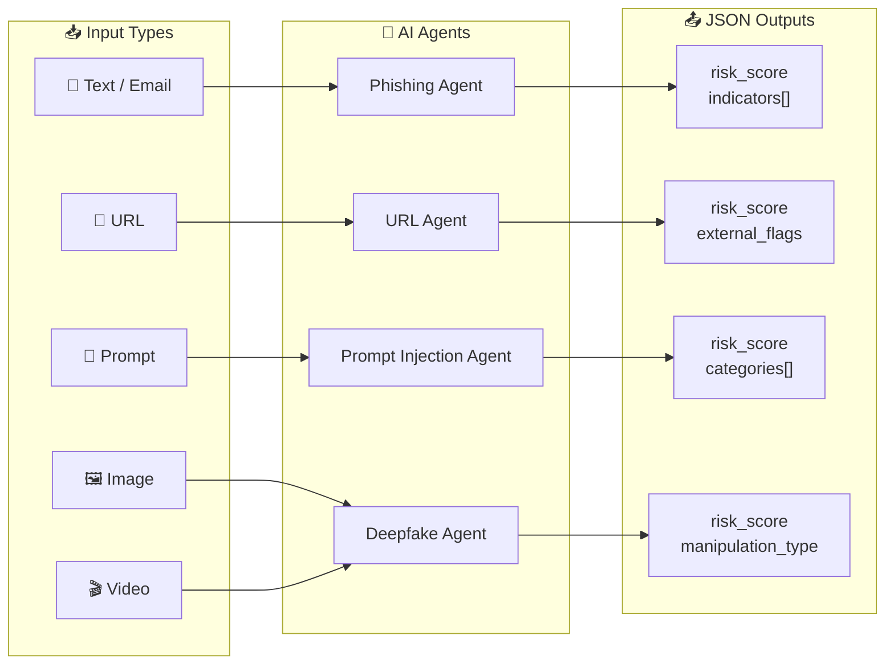
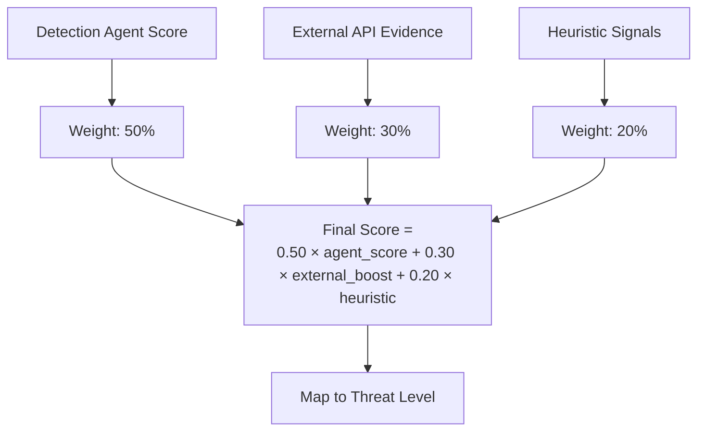

# CyberSentinel AI — Multi-Agent Engine Architecture

> **Project:** IndiaNext Hackathon 2026 — "Outthink The Algorithm"
> **Platform:** Web Application (React Dashboard + Chrome Extension + FastAPI Backend)
> **Core Concept:** Multi-agent AI engine where each threat type is handled by a dedicated Gemini-powered AI agent

---

## 1. High-Level System Overview

The CyberSentinel platform is a **web-based cybersecurity intelligence system** that orchestrates a team of specialized AI agents. Each agent is a Gemini API call with a unique system prompt tuned for one threat domain.

```
┌──────────────────────────────────────────────────────────────────────┐
│  REACT DASHBOARD (Vite + Tailwind)         CHROME EXTENSION (MV3)  │
│  ┌───────────┐ ┌──────────┐ ┌──────────┐   ┌────────────────────┐  │
│  │ Scan Panel│ │ Results  │ │ Analytics│   │ Popup + Context    │  │
│  │ URL/Text/ │ │ Dashboard│ │ Charts   │   │ Menu + Background  │  │
│  │ Prompt/   │ │          │ │          │   │ Script             │  │
│  │ Image     │ │          │ │          │   │                    │  │
│  └─────┬─────┘ └────▲─────┘ └──────────┘   └────────┬───────────┘  │
│        │            │                                │              │
│        ▼            │                                ▼              │
│  ┌──────────────────────────────────────────────────────────────┐   │
│  │              FastAPI BACKEND (API Gateway)                   │   │
│  │    Routes input → correct agent(s) → fuses results          │   │
│  └──────────────────────────────────────────────────────────────┘   │
│        │                                                            │
│        ▼                                                            │
│  ┌──────────────────────────────────────────────────────────────┐   │
│  │              EXTERNAL CLOUD SERVICES                         │   │
│  │  Gemini API (6 Agents) │ VirusTotal │ Safe Browsing │        │   │
│  │  PhishStats │ SafePrompt │ Hive AI │ MongoDB Atlas           │   │
│  └──────────────────────────────────────────────────────────────┘   │
└──────────────────────────────────────────────────────────────────────┘
```

---

## 2. The Multi-Agent Architecture

Every agent is an **independent Gemini API call** with:
- Its own **system prompt** (defining its expertise)
- Its own **JSON input schema**
- Its own **JSON output schema**
- Optional **external API enrichment** (VirusTotal, Google Safe Browsing, PhishStats, SafePrompt, Hive AI)



---

## 3. Agent Specifications

### 3.1 Agent Roster

| # | Agent Name | Input Type | External API | Key Output Fields |
|---|-----------|------------|--------------|-------------------|
| 1 | **Phishing Detection Agent** | Text / Email body | PhishStats API | `risk_score`, `indicators[]` |
| 2 | **Malicious URL Agent** | URL string | VirusTotal + Google Safe Browsing | `risk_score`, `external_flags` |
| 3 | **Prompt Injection Agent** | Prompt text | SafePrompt API | `risk_score`, `categories[]` |
| 4 | **Deepfake Indicator Agent** | Image / Video (base64) | Hive AI API | `risk_score`, `manipulation_type` |
| 5 | **Threat Explanation Agent** | All prior outputs | (none — pure LLM) | `summary_text`, `key_points[]` |
| 6 | **Recommendation Agent** | Threat level + type | (none — pure LLM) | `severity_label`, `actions[]` |

---

### 3.2 Universal Agent JSON Contract

Every agent uses the **same JSON envelope** for consistency with the backend.

**Request Envelope (Backend → Gemini):**
```json
{
  "agent": "phishing | url | prompt | deepfake | explanation | recommendation",
  "input": {
    "...": "agent-specific fields"
  }
}
```

**Response Envelope (Gemini → Backend):**
```json
{
  "agent": "phishing",
  "output": {
    "threat_type": "phishing | malicious_url | prompt_injection | deepfake | benign",
    "risk_score": 87,
    "confidence": 0.91,
    "indicators": [
      "urgency language",
      "domain mimicry: amaz0n-support.com"
    ],
    "...": "agent-specific extra fields"
  },
  "meta": {
    "model": "gemini-1.5-flash",
    "version": "v1",
    "generated_at": "2026-03-16T10:00:00Z"
  }
}
```

> **Note**: `indicators` are flat strings (not objects) for simplicity. The backend maps them to categories internally if needed.

---

## 4. Data Flow — End to End



---

## 5. Input/Output Types Per Agent



---

## 6. Gemini API Call Pattern

Every agent uses the **same HTTP pattern** — only the system prompt changes:

```python
# clients/gemini_base.py

import httpx, json, os

GEMINI_URL = "https://generativelanguage.googleapis.com/v1beta/models/gemini-1.5-flash:generateContent"
API_KEY = os.environ["GEMINI_API_KEY"]

async def call_gemini_agent(system_prompt: str, user_input: dict) -> dict:
    payload = {
        "systemInstruction": {
            "parts": [{"text": system_prompt}]
        },
        "contents": [{
            "parts": [{"text": json.dumps(user_input)}]
        }]
    }

    async with httpx.AsyncClient(timeout=30) as client:
        response = await client.post(
            f"{GEMINI_URL}?key={API_KEY}",
            json=payload
        )

    raw_text = response.json()["candidates"][0]["content"]["parts"][0]["text"]
    # Strip markdown fences if present
    clean = raw_text.strip().removeprefix("```json").removesuffix("```").strip()
    return json.loads(clean)
```

**Each agent wraps this base call:**

```python
# clients/gemini_phishing.py

PHISHING_SYSTEM_PROMPT = """
You are a cybersecurity expert specialized in phishing detection.
Analyze the input message and return ONLY valid JSON with this structure:
{
  "agent": "phishing",
  "output": {
    "threat_type": "phishing | benign",
    "risk_score": <0-100>,
    "confidence": <0.0-1.0>,
    "indicators": ["string label", ...],
    "raw_reasons": ["explanation sentence", ...]
  },
  "meta": {"model": "gemini-1.5-flash", "version": "v1", "generated_at": "<ISO-8601>"}
}
"""

async def analyze_phishing(content: str) -> dict:
    return await call_gemini_agent(
        system_prompt=PHISHING_SYSTEM_PROMPT,
        user_input={"agent": "phishing", "input": {"type": "email", "content": content}}
    )
```

---

## 7. Risk Scoring & Fusion Logic

When an input triggers a detection agent, the **Fusion Engine** computes the final score:



**Threat Level Thresholds:**

| Score Range | Threat Level | Badge Color |
|-------------|--------------|-------------|
| 0 – 30 | ✅ Safe | Green |
| 31 – 60 | ⚠️ Suspicious | Amber |
| 61 – 100 | 🔴 High Risk | Red |

---

## 8. MongoDB Data Model

```
ThreatEvent (MongoDB Document)
├── _id: ObjectId
├── event_id: UUID string
├── type: "url | text | prompt | image | video"
├── source: "extension | dashboard"
├── raw_input_snippet: String
├── threat_type: "phishing | malicious_url | prompt_injection | deepfake | benign"
├── risk_score: Int (0–100)
├── threat_level: "Safe | Suspicious | High Risk"
├── confidence: Float (0.0–1.0)
├── created_at: DateTime
│
├── indicators[]: Array of Strings
│   e.g. ["urgency language", "suspicious domain pattern"]
│
├── external_flags (0..1)
│   ├── safe_browsing: "SAFE | PHISHING | MALWARE | UNKNOWN"
│   ├── virustotal_positives: Int
│   ├── virustotal_total_engines: Int
│   ├── domain_age: "<30 days"
│   ├── phishstats_flagged: Boolean
│   ├── safeprompt_risk: String
│   └── hive_ai_result: String
│
├── explanation
│   ├── summary_text: String
│   └── key_points[]: Array of Strings
│
└── recommendations
    ├── severity_label: "Informational | Warning | Critical"
    └── actions[]: Array of Strings
```

---

## 9. Complete API Endpoints

| Method | Path | Description |
|--------|------|-------------|
| `POST` | `/api/analyze` | Main scan — routes to correct agents |
| `GET` | `/api/threats` | Fetch paginated threat history |
| `GET` | `/api/threats/{id}` | Fetch single threat detail |
| `GET` | `/api/stats` | Analytics: counts, risk trends |
| `GET` | `/api/health` | Backend health check |

**`POST /api/analyze` Request Body:**
```json
{
  "type": "url | text | prompt | image | video",
  "content": "<raw input text, URL, or base64 encoded media>",
  "source": "extension | dashboard"
}
```

**`POST /api/analyze` Response:**
```json
{
  "id": "uuid-string",
  "type": "url",
  "source": "dashboard",
  "raw_input_snippet": "http://amaz0n-login...",
  "threat_type": "malicious_url",
  "risk_score": 87,
  "threat_level": "High Risk",
  "confidence": 0.91,
  "indicators": ["domain similarity to known brand", "suspicious keywords"],
  "explanation": "This URL is likely malicious because...",
  "key_points": ["Suspicious domain detected", "Mimics Amazon login page"],
  "recommended_actions": ["Do not click", "Report to IT team"],
  "external_flags": {
    "safe_browsing": "PHISHING",
    "virustotal_positives": 12,
    "virustotal_total_engines": 70
  },
  "severity_label": "Critical",
  "created_at": "2026-03-16T10:30:00Z"
}
```

---

## 10. External API Integration Map

| API | Used By | Purpose | Free Tier |
|-----|---------|---------|-----------|
| **Google Gemini 1.5 Flash** | All 6 agents | Core AI reasoning | Generous free quota |
| **VirusTotal** | URL Agent | Community URL scan results | 4 req/min |
| **Google Safe Browsing** | URL Agent | Known malware/phishing DB | Free |
| **PhishStats** | Phishing Agent | Phishing domain/URL database | Free |
| **SafePrompt API** | Prompt Agent | Prompt injection detection | Free tier |
| **Hive AI** | Deepfake Agent | Image/video manipulation detection | Limited free |

---

## 11. Tech Stack Summary

```
┌────────────────────────────────────────────────────────────┐
│                     TECH STACK                             │
├─────────────────────┬──────────────────────────────────────┤
│ Layer               │ Technology                           │
├─────────────────────┼──────────────────────────────────────┤
│ Frontend UI         │ React + Vite + Tailwind CSS          │
│ Browser Extension   │ Chrome Extension (Manifest V3)       │
│ Charts              │ Recharts / Chart.js                  │
│ Backend API         │ Python FastAPI                       │
│ AI Agents           │ Google Gemini 1.5 Flash API          │
│ Explainability      │ Gemini Explanation Agent             │
│ URL Security        │ VirusTotal API + Google Safe Browse  │
│ Phishing DB         │ PhishStats API                       │
│ Prompt Protection   │ SafePrompt API                       │
│ Deepfake Detection  │ Hive AI API + Gemini Vision          │
│ Database            │ MongoDB Atlas (cloud)                │
│ Input Validation    │ Pydantic (Python)                    │
│ Frontend Deploy     │ Vercel / Netlify                     │
│ Backend Deploy      │ Render / Railway                     │
└─────────────────────┴──────────────────────────────────────┘
```

---

## 12. 24-Hour Build Roadmap

```mermaid
gantt
    title CyberSentinel — 24-Hour Hackathon Sprint
    dateFormat HH:mm
    axisFormat %H:%M

    section Setup
    Git repo + project structure     :00:00, 1h
    API keys + env setup             :01:00, 1h

    section Core Backend
    FastAPI skeleton + health check  :02:00, 1h
    Gemini base client               :03:00, 1h
    Phishing + URL agents            :04:00, 2h
    Prompt injection agent           :06:00, 1h
    Deepfake agent                   :07:00, 1h
    Risk fusion engine               :08:00, 1h

    section Integrations
    VirusTotal + Google Safe Browse  :09:00, 1h
    PhishStats + SafePrompt + Hive   :10:00, 1h
    MongoDB Atlas connection         :11:00, 1h

    section Explainability
    Explanation agent                :12:00, 1h
    Recommendation agent             :13:00, 1h

    section Frontend
    React dashboard scaffold         :14:00, 2h
    Scan panel + results display     :16:00, 2h
    Threat history + charts          :18:00, 2h

    section Extension & Integration
    Chrome extension                 :20:00, 1h
    Frontend ↔ Backend API wiring    :21:00, 1h

    section Polish
    Demo data + UI polish            :22:00, 1h
    Pitch deck + demo prep           :23:00, 1h
```



---

## 13. Demo Story Script (For Judges)

> **Scene:** A student receives a suspicious scholarship email.

1. **Paste email text** → App routes to Phishing Agent
2. **Agent calls Gemini** → returns risk score 89, 4 indicators
3. **Explanation panel shows:**
   - "Domain `scholarships-apply.info` is 12 days old"
   - "Urgency phrase: 'Claim in 24 hours'"
   - "Requests Aadhaar number via link"
4. **Recommendation panel shows:**
   - 🔴 Critical — Do not reply, Report to cyber helpline 1930
5. **Threat saved** to MongoDB, visible in history table

> **Then:** Paste a malicious URL → URL Agent + VirusTotal + Safe Browsing all fire simultaneously. Judges see multi-source intelligence fusion in real time.

> **Then:** Upload a suspicious image → Deepfake Agent + Hive AI analyze it. Judges see multi-modal support.

---

## 14. Bonus Features (For Extra Marks)

| Feature | Implementation |
|---------|----------------|
| **Adversarial Testing** | Submit known phishing samples, show detection rate |
| **Privacy-Preserving Design** | No raw input stored — only anonymized snippets |
| **Real-time Alerting** | Chrome extension badge + dashboard toast alerts |
| **Multi-modal Threat Fusion** | Text + URL + Image support across agents |
| **Responsible AI Safeguards** | Confidence threshold gate — low confidence = "requires human review" |
| **Deepfake Detection** | Image/video analysis via Hive AI + Gemini Vision |

---

*CyberSentinel AI — Built at IndiaNext Hackathon 2026, K.E.S. Shroff College, Mumbai.*
*"Outthink the Algorithm."*
