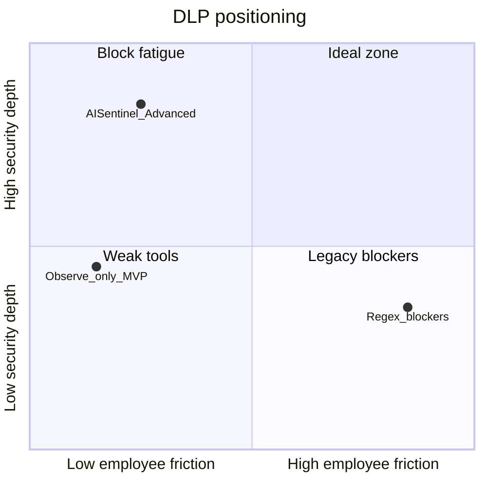

# 00 — Vision and Differentiation

## Executive summary

Most GenAI DLP browser extensions are **glorified regex checkers**: they scan for credit card patterns, SSN formats, and keyword lists, then show a harsh **"Access Blocked"** screen. Employees bypass them with personal devices, incognito windows, or copy-paste workarounds.

AISentinel's advanced roadmap shifts the product thesis from **blocking productivity** to **safeguarding data dynamically**:

- **Anonymize** before data leaves the browser
- **Understand context** (where text came from, what kind of page this is)
- **Audit locally** when policy demands air-gapped vetting
- **Educate in the moment** instead of punishing without explanation

This document defines *why* we build the five features in `features/` and how we position them for enterprise buyers.

---

## The problem with "block-only" DLP

| Failure mode | What happens | Business impact |
|--------------|--------------|-----------------|
| False positives | Normal coding prompts flagged | Security team loses trust; users disable extension |
| False negatives | Secrets in prose without regex shape slip through | Breach after the fact |
| Hard blocks | Work stops mid-flow | Shadow AI on personal accounts |
| Cloud-only scanning | Prompt sent to vendor *and* DLP vendor | Privacy review blocks deployment |
| Static URL lists | New AI tools unprotected for months | Ungoverned data exfiltration |

Our MVP ([`Plan/08_CHROME_EXTENSION_SPEC.md`](../../Plan/08_CHROME_EXTENSION_SPEC.md)) already chose **observe-first** on known platforms. Advanced features add **protect** without defaulting to block.

---

## Five extraordinary capabilities

### 1. Don't block — anonymize (tokenization)

**Competitor behavior:** Block prompt containing `sk-...` or company name.

**AISentinel behavior:** Replace `Apple Inc.` → `<COMPANY_1>`, `encryption key XYZ` → `<KEY_1>` before network; swap back in UI when the model responds.

**Buyer message:** *"Your employees keep working. The AI vendor never trains on your secrets."*

### 2. Clipboard lineage

**Competitor behavior:** Same regex on pasted text whether from Wikipedia or internal Salesforce.

**AISentinel behavior:** If copy originated on `jira.company.internal`, paste into ChatGPT triggers higher scrutiny even when text has no obvious PII.

**Buyer message:** *"We protect context, not just characters."*

### 3. Shadow AI detection

**Competitor behavior:** Blocklist of 20 URLs; miss self-hosted Gradio apps.

**AISentinel behavior:** Heuristic DOM + streaming patterns detect unknown AI UIs; apply org policy automatically.

**Buyer message:** *"Security keeps pace with the long tail of AI tools."*

### 4. Local WASM / WebGPU audit

**Competitor behavior:** Send prompt to another cloud API to classify risk.

**AISentinel behavior:** Quantized classifier runs in-browser; optional hybrid server enrichment for audit only.

**Buyer message:** *"Classification air-gapped on the endpoint."*

### 5. JIT micro-training

**Competitor behavior:** Opaque block with no learning.

**AISentinel behavior:** 5-second contextual question + checkbox; justification logged for compliance.

**Buyer message:** *"Continuous security culture, auditable decisions."*

---

## Positioning matrix

Target quadrant: **high security depth, low friction** — achieved by anonymization + JIT, not walls.

---

## Principles (non-negotiable)

1. **Default safe, not default broken** — Feature flags off = current observe-only MVP behavior.
2. **Latency budget** — Input-path processing ≤50ms p95 ([`10_MANIFEST_MV3_AND_PERFORMANCE.md`](./10_MANIFEST_MV3_AND_PERFORMANCE.md)).
3. **Honest limits** — Document what browsers cannot do (clipboard origin, non-DOM API calls).
4. **Enterprise MV3** — Chrome + Edge, managed policy compatible.
5. **Backward-compatible APIs** — New ingest fields optional; old extensions keep working.

---

## What we will not claim

| Claim | Reality |
|-------|---------|
| "Reads clipboard source URL from Chrome" | False — we implement lineage via our own copy hooks on configured domains |
| "Blocks all AI usage everywhere" | Requires network proxy or MDM; extension covers DOM-submit path |
| "100% prevents leaks" | Defense in depth; human bypass always possible |
| "Zero latency" | Target &lt;50ms, not zero |

Transparency builds trust with CISOs who have been oversold.

---

## Success metrics (post-rollout)

| Metric | Target |
|--------|--------|
| Bypass rate | ↓ vs hard-block baseline (measure uninstalls, incognito policy hits) |
| False positive rate on benign dev prompts | &lt;2% flagged medium+ |
| Secret exposure to AI vendor | 0 raw secrets in network payload when anonymize enforced |
| JIT completion rate | &gt;90% on triggered gates (not abandoned sessions) |
| Shadow AI discovery | # of new domains flagged per org per month → reviewed |

---

## Cross-references

| Topic | Plan doc | New features doc |
|-------|----------|------------------|
| Extension MVP | [`Plan/08_CHROME_EXTENSION_SPEC.md`](../../Plan/08_CHROME_EXTENSION_SPEC.md) | [`features/01`](./features/01_ANONYMIZATION_TOKENIZATION.md) … [`05`](./features/05_JIT_MICRO_TRAINING.md) |
| DLP engine | [`Plan/14_RISK_DETECTION_ENGINE.md`](../../Plan/14_RISK_DETECTION_ENGINE.md) | [`features/04`](./features/04_LOCAL_WASM_WEBGPU_AUDIT.md), [`09`](./09_BACKEND_API_AND_SCHEMA.md) |
| Policies | [`Plan/15_POLICIES_SPEC.md`](../../Plan/15_POLICIES_SPEC.md) | [`07`](./07_INTEGRATION_MASTER_PLAN.md), [`09`](./09_BACKEND_API_AND_SCHEMA.md) |
| Implementation gates | [`Plan/17_IMPLEMENTATION_SEQUENCE.md`](../../Plan/17_IMPLEMENTATION_SEQUENCE.md) | [`07`](./07_INTEGRATION_MASTER_PLAN.md) (NF-0 … NF-6 after Gate 7) |

---

## Next steps for implementers

1. Read [06_TECH_STACK_AND_LANGUAGES.md](./06_TECH_STACK_AND_LANGUAGES.md)
2. Read [08_SYSTEM_ARCHITECTURE.md](./08_SYSTEM_ARCHITECTURE.md)
3. Pick a phase from [07_INTEGRATION_MASTER_PLAN.md](./07_INTEGRATION_MASTER_PLAN.md)
4. Implement one feature doc end-to-end before starting the next
