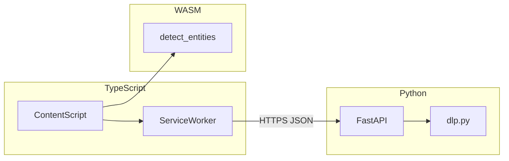

# 06 — Tech Stack and Languages

## Executive summary

The **extension analysis engine** should be built primarily in **TypeScript**, compiled to ES modules for Manifest V3. Performance-critical entity detection may use **Rust compiled to WebAssembly**. Optional semantic classification uses **ONNX Runtime Web** or **transformers.js** with WebGPU when available. Server reinforcement remains **Python / FastAPI**; admin UI remains **React + Vite**.

---

## Stack overview

| Layer | Language / runtime | Primary libraries | Owns |
|-------|-------------------|-------------------|------|
| Content script (hot path) | **TypeScript** | esbuild or Vite | DOM hooks, tokenizer, JIT UI, lineage consumer |
| Service worker | **TypeScript** | chrome.* APIs | Policy cache, ingest queue, alarms |
| Entity parser (fast) | **Rust → WASM** | `regex`, `serde` | Sub-5ms pattern scan |
| Semantic classifier (optional) | **ONNX / WASM** | `onnxruntime-web` or `@huggingface/transformers` | 20–40ms risk score |
| Backend DLP + policies | **Python 3.11+** | FastAPI, Beanie | Audit, hybrid scoring, org config |
| Dashboard | **TypeScript/JSX** | React 18, Vite | Policy editor, reports |
| E2E tests | **TypeScript** | Playwright + extension loader | Regression |

---

## Why TypeScript for the extension (not Python, not Go in-browser)

| Option | Verdict |
|--------|---------|
| **TypeScript** | Native to browsers; shares types with dashboard; MV3 examples; enterprise teams expect it |
| Python in extension | Not runnable in content scripts without Pyodide (huge, slow) |
| Go → WASM only | Possible for parsers but poor DOM ergonomics; use as WASM helper only |
| Plain JS (current MVP) | Worked for Gate 6; insufficient for multi-module features at scale |

**Migration path:** NF-0 introduces `extension/src/` + build to `extension/dist/` without changing runtime behavior ([`07_INTEGRATION_MASTER_PLAN.md`](./07_INTEGRATION_MASTER_PLAN.md)).

---

## Build toolchain (recommended)

```json
// extension/package.json (future)
{
  "scripts": {
    "build": "esbuild src/background/index.ts src/content/index.ts --bundle --outdir=dist --format=esm",
    "test": "vitest",
    "typecheck": "tsc --noEmit"
  },
  "devDependencies": {
    "esbuild": "^0.24.0",
    "typescript": "^5.6.0",
    "vitest": "^2.1.0",
    "@types/chrome": "^0.0.270"
  }
}
```

Alternative: **Vite** multi-entry build if we need JSX for JIT overlay components.

---

## Rust → WASM module (optional, NF-2+)

**Crate layout:**

```
extension/wasm/
├── Cargo.toml
├── src/
│   └── lib.rs          # detect_entities(text) -> JSON
└── pkg/                # wasm-pack output
```

**Exported function (illustrative):**

```rust
#[wasm_bindgen]
pub fn detect_entities(text: &str) -> String {
    // Returns JSON: [{ "type": "API_KEY", "start": 10, "end": 42, "severity": "CRITICAL" }]
}
```

**When to use:** Prompts &gt;2KB or &gt;20 regex patterns; target &lt;5ms WASM vs 15ms pure JS.

---

## Local ML options (NF-2+)

| Library | Bundle size | WebGPU | Best for |
|---------|-------------|--------|----------|
| **onnxruntime-web** | 5–8MB + model | Yes | Custom fine-tuned classifier ONNX |
| **@huggingface/transformers** | 10–25MB | Yes | Rapid prototyping with MiniLM |
| **Rules + WASM only** | &lt;500KB | N/A | Conservative enterprises, v1 ship |

**Recommendation:** Ship **rules + WASM** in NF-2; add ONNX model as org-downloaded encrypted blob in NF-6 to control extension CRX size.

---

## Python backend (existing)

Continue extending [`aisentinel/backend/services/dlp.py`](../backend/services/dlp.py):

- Hybrid score: `final_risk = max(client_risk, server_risk)` with explainability merge
- Never require client to send raw secrets when `was_anonymized=true`
- Policy evaluation service (new module `services/policy_engine.py`)

---

## React dashboard (existing)

New pages (future, not in Plan/ edits):

| Page | Purpose |
|------|---------|
| `/settings/policies` | `anonymize_mode`, `jit_mode`, feature flags |
| `/settings/sensitive-domains` | Clipboard lineage sources |
| `/security/shadow-ai` | Review queue for heuristic detections |

Use same `client.js` axios instance as MVP.

---

## Data flow languages by stage



---

## Security coding standards

| Rule | Rationale |
|------|-----------|
| Token maps stay in `chrome.storage.session` | Cleared on browser close |
| Never log raw secrets to `console` in production builds | Strip in esbuild `drop: ['console']` |
| CSP-compliant overlay (Shadow DOM) | Avoid page CSS injection attacks |
| Subresource Integrity for WASM blobs | Tamper detection |
| Minimize `host_permissions` | Enterprise security review |

---

## Version matrix

| Component | Minimum |
|-----------|---------|
| Chrome / Edge | 120+ (WebGPU optional) |
| Node (build) | 18 LTS |
| Python | 3.11+ |
| TypeScript | 5.x |

---

## Cross-references

- Architecture: [08_SYSTEM_ARCHITECTURE.md](./08_SYSTEM_ARCHITECTURE.md)
- MV3 permissions: [10_MANIFEST_MV3_AND_PERFORMANCE.md](./10_MANIFEST_MV3_AND_PERFORMANCE.md)
- Per-feature stacks: `features/01` … `features/05`
