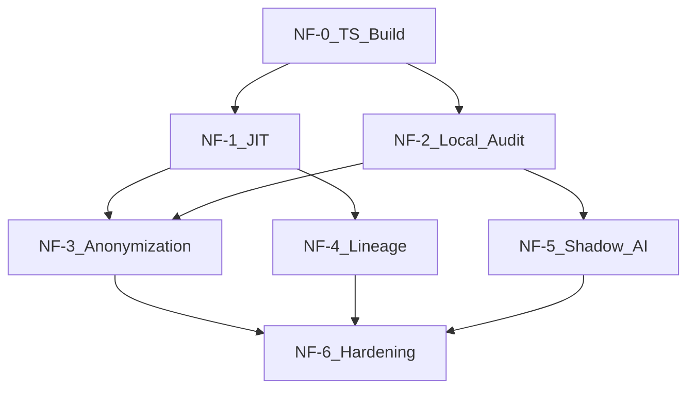

# 07 — Integration Master Plan

## Executive summary

This document defines **phased gates NF-0 through NF-6** that extend AISentinel after Plan Gate 7 ([`Plan/17_IMPLEMENTATION_SEQUENCE.md`](../../Plan/17_IMPLEMENTATION_SEQUENCE.md)). Each phase ships working software with **feature flags defaulting off** so the current MVP never breaks.

---

## Dependency graph



**Recommended order:** NF-0 → NF-1 → NF-2 → NF-3 → NF-4 → NF-5 → NF-6  
NF-4 and NF-5 can parallelize after NF-2 if two developers.

---

## Global "no broken code" gates

Every phase must pass before merge:

| Check | Command / action |
|-------|------------------|
| Extension builds | `cd aisentinel/extension && npm run build` |
| Extension types | `npm run typecheck` |
| Backend tests | `cd aisentinel/backend && py -m pytest` |
| Manual E2E | ChatGPT submit → event in dashboard (observe mode) |
| Feature flag off | Identical behavior to pre-phase MVP |
| API backward compat | Old extension payload still returns 201 |
| Perf smoke | Submit path &lt;50ms p95 with flags on (NF-2+) |

---

## NF-0 — Extension build foundation

**Read:** [06_TECH_STACK_AND_LANGUAGES.md](./06_TECH_STACK_AND_LANGUAGES.md), [10_MANIFEST_MV3_AND_PERFORMANCE.md](./10_MANIFEST_MV3_AND_PERFORMANCE.md)

### Tasks

1. Add `extension/package.json`, `tsconfig.json`, esbuild config
2. Port [`content.js`](../../extension/content.js) → `src/content/index.ts` (behavior parity)
3. Port [`background.js`](../../extension/background.js) → `src/background/index.ts`
4. Port [`helpers.js`](../../extension/utils/helpers.js) → `src/shared/platform.ts`
5. Point `manifest.json` at `dist/*`
6. Add Vitest for `normalizeForHash`, platform detection

### Acceptance

- [ ] Load unpacked `dist/` in Chrome — events ingest identically
- [ ] No new permissions
- [ ] CI job `extension-build` passes

### Risk: Low

---

## NF-1 — Policy cache + JIT micro-training

**Read:** [features/05_JIT_MICRO_TRAINING.md](./features/05_JIT_MICRO_TRAINING.md), [09_BACKEND_API_AND_SCHEMA.md](./09_BACKEND_API_AND_SCHEMA.md)

### Tasks

1. `GET /api/policies/cache` + seed default policy in org settings
2. Service worker: policy refresh alarm (15 min)
3. Implement `jit-overlay.ts` + `jit-triggers.ts`
4. Extend ingest with optional `jit_decision`
5. Dashboard: show JIT block in event detail modal

### Feature flags

```json
{ "features": { "jit_training": false, "policy_cache": true } }
```

### Acceptance

- [ ] JIT off → no UI regression
- [ ] JIT attest on test org → modal + stored decision
- [ ] Cancel does not POST event

### Risk: Low

---

## NF-2 — Client hybrid audit

**Read:** [features/04_LOCAL_WASM_WEBGPU_AUDIT.md](./features/04_LOCAL_WASM_WEBGPU_AUDIT.md)

### Tasks

1. Port DLP v2 rules to `audit-rules.ts` (or WASM crate)
2. `engine/audit.ts` returns `ClientAuditResult`
3. `hybrid_dlp.py` merges client + server scores
4. Ingest: `client_risk_score`, `client_model_version`, `client_timing_ms`
5. Benchmark harness ([11_TESTING](./11_TESTING_QA_AND_ROLLOUT.md))

### Feature flags

```json
{ "features": { "local_audit": false } }
```

### Acceptance

- [ ] Flag off → server-only scoring (current)
- [ ] Flag on → client findings visible on event detail
- [ ] p95 audit &lt;15ms rules-only on 2KB text

### Risk: Medium (perf)

---

## NF-3 — Anonymization v1

**Read:** [features/01_ANONYMIZATION_TOKENIZATION.md](./features/01_ANONYMIZATION_TOKENIZATION.md)

### Tasks

1. `tokenizer.ts`, `detokenizer.ts`, `vault.ts`
2. Response `MutationObserver` for ChatGPT + Claude
3. Ingest: `was_anonymized`, `prompt_text` redacted, `entity_summary`
4. MAIN-world fetch hook (behind flag `anonymize_network_hook`)
5. E2E: DevTools verifies no secret in fetch body

### Feature flags

```json
{
  "anonymize_mode": "off",
  "features": { "anonymization": false }
}
```

### Acceptance

- [ ] `enforce` on test org → round-trip de-tokenize
- [ ] `off` → raw prompt to API (MVP)
- [ ] Vault not in network payload

### Risk: Medium (E2E complexity)

---

## NF-4 — Clipboard lineage

**Read:** [features/02_CLIPBOARD_LINEAGE.md](./features/02_CLIPBOARD_LINEAGE.md)

### Tasks

1. `sensitive-domains` API + dashboard page
2. `lineage/tagger.ts` with optional permissions
3. `lineage/consumer.ts` on AI pages
4. Ingest: `clipboard_lineage` object
5. Server lineage score boost

### Feature flags

```json
{ "features": { "clipboard_lineage": false } }
```

### Acceptance

- [ ] Tagged copy → paste shows lineage in Events UI
- [ ] Untagged copy → `unknown`
- [ ] LRU cap enforced

### Risk: Medium (enterprise domain config)

---

## NF-5 — Shadow AI detection

**Read:** [features/03_SHADOW_AI_DETECTION.md](./features/03_SHADOW_AI_DETECTION.md)

### Tasks

1. `shadow-ai.ts` heuristic engine
2. `activeTab` + `scripting` injection for unknown hosts
3. `POST /api/shadow-ai/discoveries` + review queue API
4. Dashboard Shadow AI page (minimal table)
5. Allowlist sync in policy cache

### Feature flags

```json
{ "features": { "shadow_ai_detection": false } }
```

### Acceptance

- [ ] Gradio HTML fixture passes in unit test
- [ ] Known hosts unchanged
- [ ] Allowlist suppresses repeat alerts

### Risk: Medium (false positives)

---

## NF-6 — Full stack hardening

**Read:** [10_MANIFEST_MV3_AND_PERFORMANCE.md](./10_MANIFEST_MV3_AND_PERFORMANCE.md), [11_TESTING_QA_AND_ROLLOUT.md](./11_TESTING_QA_AND_ROLLOUT.md)

### Tasks

1. IndexedDB offline ingest queue + alarm retry
2. Optional ONNX download + signature verify
3. End-to-end perf dashboard (`client_timing_ms` aggregates)
4. Playwright extension test suite in CI
5. Edge + Chrome enterprise policy doc snippet
6. Security review checklist complete

### Acceptance

- [ ] Airplane mode → events queue → flush on reconnect
- [ ] Full pipeline p95 &lt;50ms on reference device
- [ ] All NF-1–5 flags can enable together without regression

### Risk: Low

---

## Target extension tree (post NF-0)

```
aisentinel/extension/
├── manifest.json
├── package.json
├── tsconfig.json
├── esbuild.config.mjs
├── src/
│   ├── background/index.ts
│   ├── content/index.ts
│   ├── inject/fetch-hook.ts
│   ├── engine/
│   │   ├── pipeline.ts
│   │   ├── tokenizer.ts
│   │   ├── detokenizer.ts
│   │   ├── vault.ts
│   │   ├── audit.ts
│   │   ├── shadow-ai.ts
│   │   └── jit-triggers.ts
│   ├── lineage/
│   │   ├── tagger.ts
│   │   └── consumer.ts
│   ├── ui/jit-overlay.ts
│   └── shared/
│       ├── messages.ts
│       └── platform.ts
├── wasm/                    # optional
├── dist/                    # Chrome loads this
└── tests/
```

---

## Backend modules (cumulative)

| Module | Phase |
|--------|-------|
| `api/policies.py` | NF-1 |
| `services/hybrid_dlp.py` | NF-2 |
| `api/sensitive_domains.py` | NF-4 |
| `api/shadow_ai.py` | NF-5 |
| `services/policy_engine.py` | NF-1 |

---

## Dashboard pages (cumulative)

| Page | Phase |
|------|-------|
| Event detail JIT section | NF-1 |
| Settings → Policies | NF-1 |
| Settings → Sensitive domains | NF-4 |
| Security → Shadow AI queue | NF-5 |

---

## Rollback strategy

| Level | Action |
|-------|--------|
| Org | Admin sets `features.* = false` in dashboard |
| Deploy | Ship extension with flags off; enable per org via API |
| Emergency | Publish previous CRX version in Chrome Web Store |

---

## Cross-references

- API/schema detail: [09_BACKEND_API_AND_SCHEMA.md](./09_BACKEND_API_AND_SCHEMA.md)
- Testing: [11_TESTING_QA_AND_ROLLOUT.md](./11_TESTING_QA_AND_ROLLOUT.md)
- Architecture: [08_SYSTEM_ARCHITECTURE.md](./08_SYSTEM_ARCHITECTURE.md)
