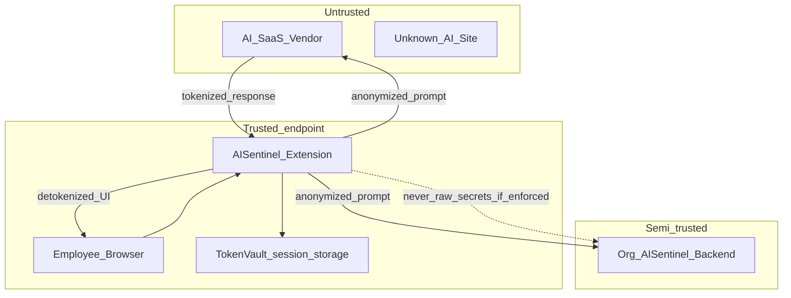
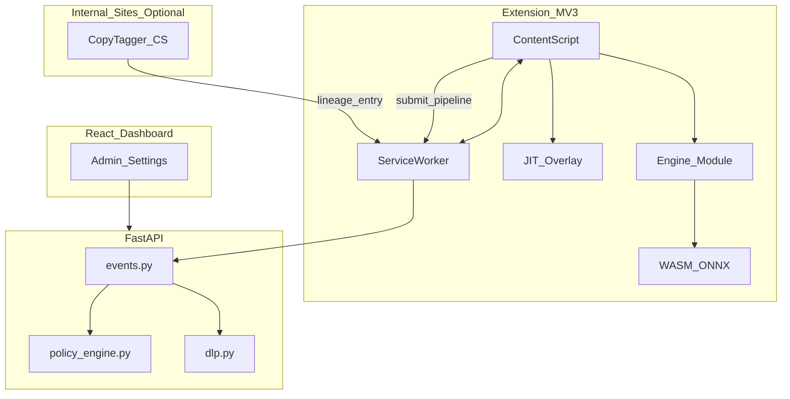
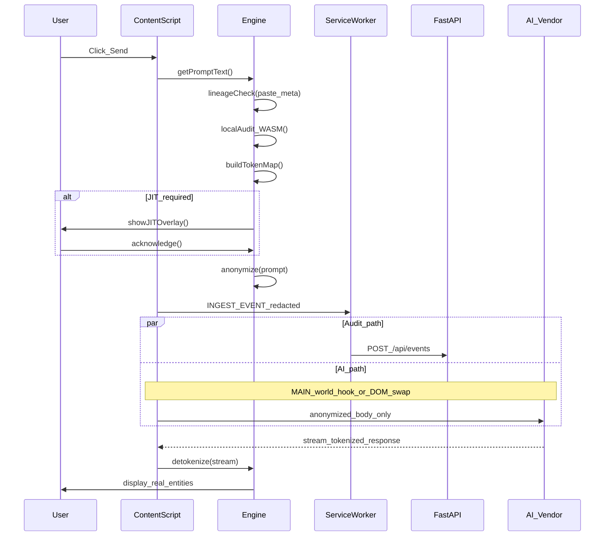
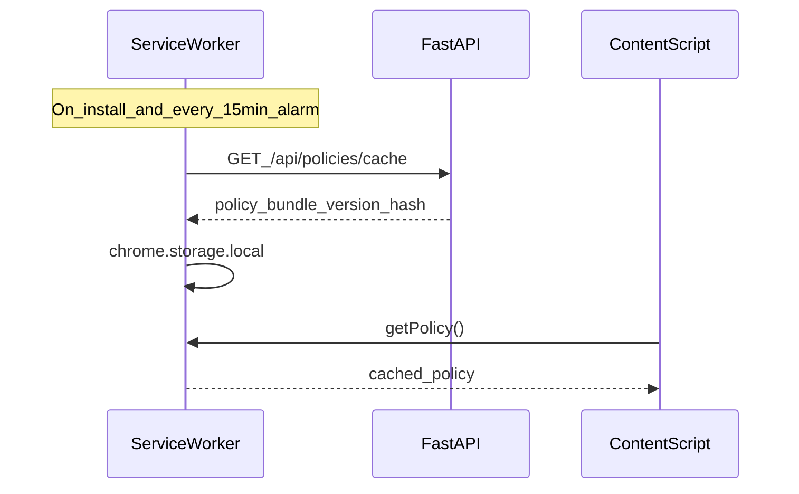

# 08 — System Architecture

## Executive summary

Advanced AISentinel adds a **client-side protection pipeline** in the browser extension, optional **origin taggers** on internal apps, and **server-side policy + audit** reinforcement. The employee sees de-tokenized AI answers; the AI vendor and org backend receive redacted or policy-compliant payloads.

---

## Trust boundaries



| Zone | Data allowed |
|------|----------------|
| Extension + session vault | Raw secrets, token maps |
| Network to AI vendor | Placeholder tokens only (enforce mode) |
| AISentinel backend | Redacted prompt + metadata + optional encrypted map reference |
| Dashboard (admin) | Redacted by default; reveal raw with RBAC + audit log (future) |

---

## Component diagram



---

## Submit pipeline (target state)

Sequence when employee sends a prompt on an AI page:



**MVP today:** Only `INGEST_EVENT` with full `prompt_text` to API — no anonymization, no AI intercept ([`content.js`](../extension/content.js)).

---

## Module responsibilities (future `extension/src/`)

| Module | Path | Responsibility |
|--------|------|----------------|
| `content/index.ts` | Entry | Wire DOM observers, delegate to pipeline |
| `engine/pipeline.ts` | Orchestrator | Ordered stages, timing metrics |
| `engine/tokenizer.ts` | Anonymize | Entity → placeholder |
| `engine/detokenizer.ts` | De-anonymize | Response stream swap |
| `engine/vault.ts` | Storage | Session-scoped maps |
| `engine/lineage.ts` | Clipboard | Hash lookup / tag on copy |
| `engine/shadow-ai.ts` | Detection | Heuristic score |
| `engine/audit.ts` | Risk | WASM + optional ONNX |
| `ui/jit-overlay.ts` | UX | Blur + attestation |
| `background/index.ts` | SW | Policy fetch, queue, ingest |
| `shared/messages.ts` | Types | `INGEST_EVENT`, `POLICY_UPDATE` |

---

## Policy distribution



Policy bundle includes: `anonymize_mode`, `jit_mode`, `sensitive_domains`, `feature_flags`, `shadow_ai_threshold`.

---

## Hybrid risk scoring

| Source | Field | Weighting |
|--------|-------|-----------|
| Client WASM/ONNX | `client_risk_score`, `client_findings[]` | First signal; can trigger JIT |
| Server `dlp.py` | `risk_score`, `risk_level` | Authoritative for alerts when anonymized text sent |
| Lineage | `clipboard_lineage.sensitivity` | Bump score +15 if `internal_restricted` |

```python
# Illustrative server merge (future dlp.py)
def hybrid_score(client: int, server: int, lineage_boost: int = 0) -> int:
    return min(100, max(client, server) + lineage_boost)
```

---

## Storage model (client)

| Store | Key pattern | TTL | Contents |
|-------|-------------|-----|----------|
| `chrome.storage.sync` | `apiBase`, `orgToken`, `userToken` | Persistent | Config (existing) |
| `chrome.storage.local` | `policy:v{hash}` | Until update | Policy JSON |
| `chrome.storage.session` | `vault:{sessionId}` | Browser session | Token maps |
| `chrome.storage.session` | `lineage:{hash}` | Browser session | Copy metadata |
| IndexedDB (optional NF-6) | `offline_queue` | Until ack | Failed ingest retries |

---

## Deployment topologies

| Topology | Extension role | Backend |
|----------|----------------|---------|
| **SaaS** | All employees → `api.aisentinel.io` | Multi-tenant MongoDB |
| **Single-tenant VPC** | Same CRX, custom API URL in popup | Customer-hosted FastAPI |
| **Air-gapped audit** | Local ONNX only; ingest metadata-only mode | Optional |

---

## Failure and degrade modes

| Failure | Behavior |
|---------|----------|
| WASM load fail | Fall back to TS regex ([`dlp.py`](../backend/services/dlp.py) patterns ported) |
| Policy fetch fail | Use last cached policy; if none, **observe-only MVP** |
| ONNX timeout (&gt;50ms) | Skip semantic tier; rules-only |
| API ingest fail | Queue in IndexedDB; alarm retry |
| De-tokenize mismatch | Log `DETOKENIZE_MISS`; show tokens to user with warning banner |

---

## Cross-references

- Stack choices: [06_TECH_STACK_AND_LANGUAGES.md](./06_TECH_STACK_AND_LANGUAGES.md)
- API/schema: [09_BACKEND_API_AND_SCHEMA.md](./09_BACKEND_API_AND_SCHEMA.md)
- Performance: [10_MANIFEST_MV3_AND_PERFORMANCE.md](./10_MANIFEST_MV3_AND_PERFORMANCE.md)
- Feature details: `features/01` … `features/05`
