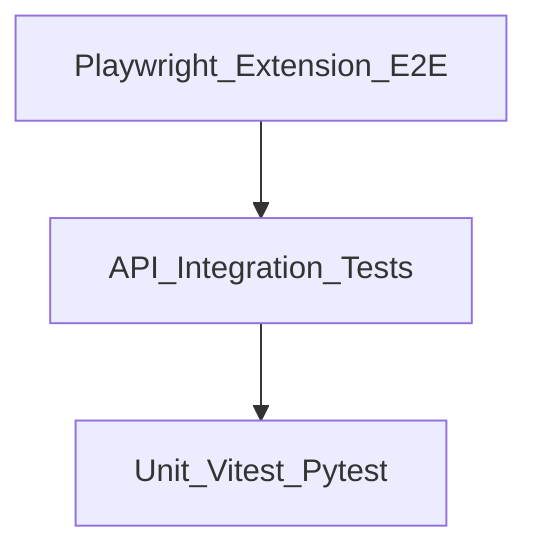

# 11 — Testing, QA, and Rollout

## Executive summary

Advanced features require **automated tests**, **performance benchmarks**, and **staged rollout** per organization. This document defines test types, fixtures, CI jobs, and pilot → GA criteria.

---

## Test pyramid



| Layer | Tool | Scope |
|-------|------|-------|
| Unit | Vitest (extension), pytest (backend) | Tokenizer, lineage hash, shadow heuristic, hybrid_dlp |
| Integration | pytest + httpx | Ingest with new fields, policy cache |
| E2E | Playwright | Load extension, ChatGPT mock page, submit flow |
| Perf | Custom benchmark script | 50ms p95 submit pipeline |

---

## Unit tests — extension (Vitest)

### Tokenizer ([01](./features/01_ANONYMIZATION_TOKENIZATION.md))

```typescript
describe('tokenizer', () => {
  it('replaces API key with KEY_1', () => {
    const r = anonymize('use sk-test1234567890abcdef0123456789');
    expect(r.redactedText).not.toContain('sk-test');
    expect(r.map.tokens['<KEY_1>']).toBeDefined();
  });

  it('round-trips detokenize', () => {
    const r = anonymize('Hello Apple Inc.');
    const back = detokenize('Hello <COMPANY_1>', r.map);
    expect(back).toBe('Hello Apple Inc.');
  });
});
```

### Lineage hash ([02](./features/02_CLIPBOARD_LINEAGE.md))

```typescript
it('same hash for normalized variants', () => {
  expect(hash('  Hello  ')).toBe(hash('hello'));
});
```

### Shadow AI ([03](./features/03_SHADOW_AI_DETECTION.md))

Fixtures: `tests/fixtures/gradio-chat.html`, `google-docs.html`, `chatgpt-minimal.html`

```typescript
it('scores Gradio fixture above threshold', () => {
  const doc = loadFixture('gradio-chat.html');
  expect(new ShadowAiDetector().scan(doc).score).toBeGreaterThanOrEqual(65);
});
```

### JIT triggers ([05](./features/05_JIT_MICRO_TRAINING.md))

```typescript
it('triggers on score 55', () => {
  expect(shouldShowJit({ client_risk_score: 55 }, policy)).toBe(true);
});
it('does not trigger on critical', () => {
  expect(shouldShowJit({ client_risk_level: 'critical' }, policy)).toBe(false);
});
```

---

## Unit tests — backend (pytest)

Existing: [`tests/test_dlp.py`](../../backend/tests/test_dlp.py)

Add:

```
tests/test_hybrid_dlp.py
tests/test_policy_engine.py
tests/test_ingest_extended.py
```

### hybrid_dlp examples

```python
def test_client_score_wins_when_higher():
    server = scan_prompt("benign")
    merged = merge_hybrid(80, [], server)
    assert merged.risk_score >= 80

def test_lineage_boost():
    server = scan_prompt("summarize this report")
    merged = apply_lineage_boost(server, {"sensitivity_label": "internal_restricted"})
    assert merged.risk_score >= server.risk_score + 15
```

### Ingest backward compat

```python
async def test_legacy_payload_still_201(client, org_headers, user_token):
    body = { /* MVP fields only */ }
    r = await client.post("/api/events", json=body, headers=org_headers)
    assert r.status_code == 201
```

---

## Integration tests

| Scenario | Assert |
|----------|--------|
| Policy cache 304 | Second fetch with ETag unchanged |
| JIT decision stored | Event detail includes `jit_decision.triggered` |
| Anonymized ingest | `was_anonymized=true`, server scan has no raw secret substring |
| Shadow discovery POST | Row in `shadow_ai_discoveries` |

Use `STORAGE_BACKEND=memory` + seed ([`scripts/seed.py`](../../backend/scripts/seed.py)).

---

## E2E tests (Playwright)

### Setup

```typescript
// playwright.config.ts
use: {
  channel: 'chrome',
  launchOptions: {
    args: [
      `--disable-extensions-except=${extensionPath}`,
      `--load-extension=${extensionPath}`,
    ],
  },
},
```

### Critical paths

| ID | Steps | Pass |
|----|-------|------|
| E2E-01 | Configure popup tokens → open ChatGPT mock → submit | Event in API mock |
| E2E-02 | Enable JIT attest → borderline prompt → cancel | No event |
| E2E-03 | Enable anonymize enforce → submit secret | Network body tokenized |
| E2E-04 | Copy on tagged fixture → paste → submit | `clipboard_lineage.status=resolved` |

Use **mock HTML pages** served from `localhost` in extension `host_permissions` for CI stability (avoid flaking on live ChatGPT DOM).

---

## Performance benchmarks

Script: `extension/scripts/bench-audit.mjs`

```javascript
const samples = [
  { name: 'short_clean', text: 'What is the weather?' },
  { name: 'long_code', text: readFileSync('fixtures/code-2kb.txt', 'utf8') },
  { name: 'secrets', text: 'key sk-test1234567890abcdef0123456789' },
];

for (const s of samples) {
  const times = [];
  for (let i = 0; i < 100; i++) {
    const t0 = performance.now();
    await runPipeline(s.text);
    times.push(performance.now() - t0);
  }
  console.log(s.name, 'p95', percentile(times, 95));
}
```

**Gate:** `secrets` and `long_code` p95 ≤50ms with rules-only audit on GitHub Actions `ubuntu-latest`.

Upload `client_timing_ms` aggregates to dashboard (future metric).

---

## Security tests

| Test | Method |
|------|--------|
| Vault not in API | Assert ingest JSON keys |
| De-tokenize only in extension | No server endpoint returns vault |
| postMessage origin | Fuzz wrong origin → ignored |
| WASM integrity | Tamper file → load fails |
| XSS in JIT overlay | Inject `<script>` in body text → escaped |

---

## Manual QA checklist (release)

### Observe-only (flags off)

- [ ] ChatGPT submit → event appears
- [ ] Claude submit → event appears
- [ ] Gemini submit → event appears
- [ ] Popup save tokens persists
- [ ] Dashboard login + Events detail

### With flags on (pilot org)

- [ ] JIT attest flow
- [ ] Anonymize round-trip visible in UI
- [ ] Lineage from tagged domain
- [ ] Shadow AI discovery alert
- [ ] Offline queue flush after reconnect

---

## CI pipeline (recommended)

```yaml
# .github/workflows/aisentinel.yml (future)
jobs:
  backend:
    runs-on: ubuntu-latest
    steps:
      - run: pip install -r requirements.txt
      - run: pytest
  extension:
    runs-on: ubuntu-latest
    steps:
      - run: npm ci && npm run build && npm test
      - run: node scripts/bench-audit.mjs
  e2e:
    runs-on: ubuntu-latest
    steps:
      - run: npx playwright test
```

---

## Rollout strategy

### Phase 1 — Internal dogfood

- Enable all flags on `demo` org only
- Fix false positives for 2 weeks

### Phase 2 — Design partners (3–5 orgs)

- `jit_mode: attest`, `anonymize_mode: suggest`, `local_audit: true`
- Weekly review of `client_timing_ms` and bypass feedback

### Phase 3 — GA

- Chrome Web Store submission with privacy policy update
- Default new orgs: `jit_mode: log_only`, others off
- Enterprise: GPO force-install + managed storage for API URL

### Feature flag API

```http
PATCH /api/policies
Authorization: Bearer <admin_jwt>
{ "settings": { "features": { "anonymization": true }, "anonymize_mode": "enforce" } }
```

### Rollback

| Severity | Action |
|----------|--------|
| P0 data leak | Disable feature globally via config service |
| P1 perf | Disable `local_audit` ONNX, keep rules |
| P2 false positives | Tune thresholds per org |

---

## Definition of Done (entire advanced program)

- [ ] All NF-0 … NF-6 acceptance criteria in [07_INTEGRATION_MASTER_PLAN.md](./07_INTEGRATION_MASTER_PLAN.md) met
- [ ] CI green on main
- [ ] Privacy policy and Chrome Web Store justifications updated
- [ ] Documentation in `new features/` matches shipped behavior
- [ ] No regression in MVP path with all flags disabled

---

## Cross-references

- Performance budget: [10_MANIFEST_MV3_AND_PERFORMANCE.md](./10_MANIFEST_MV3_AND_PERFORMANCE.md)
- Original testing plan: [`Plan/12_TESTING_STRATEGY.md`](../../Plan/12_TESTING_STRATEGY.md)
- Admin verify: [`Plan/19_ADMIN_VERIFY_DASHBOARD.md`](../../Plan/19_ADMIN_VERIFY_DASHBOARD.md)
