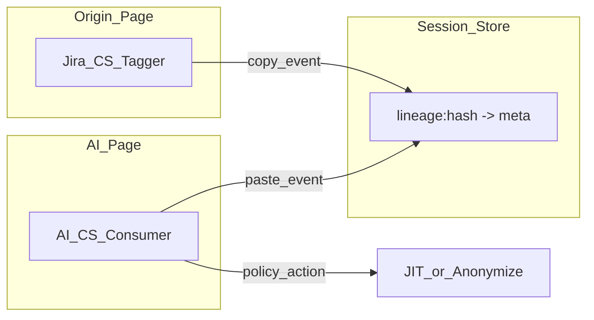

# Feature 02 — Clipboard Lineage and Origin Tracking

## Part I — Deep explanation

### Problem statement

Once text is on the clipboard, **all paste looks identical** to a regex DLP tool — whether from Wikipedia or from the CFO's internal Excel export. Employees exfiltrate confidential data without typing obvious keywords like "confidential."

**Lineage** answers: *where was this copied from?*

### Critical browser truth (honest)

**Chrome does not expose clipboard source URL or originating application to extensions.**

We implement lineage by:

1. **Tagging copies** on configured internal domains (content script on `copy` event)
2. **Storing metadata** keyed by normalized text hash in `chrome.storage.session`
3. **Resolving on paste** into AI inputs — lookup hash → apply policy

Without a tagger on the source site, lineage is **unknown** (not "safe").

### User story

> Employee copies a Jira ticket from `company.atlassian.net` containing customer revenue.  
> They paste into ChatGPT.  
> Extension shows: *"Pasted content originated from Internal — Jira. Confirm you have scrubbed customer data."*  
> JIT gate or auto-anonymize per policy.

### Architecture: dual content script model



### Copy tagger behavior

On `document.addEventListener('copy', ...)`:

1. `const text = window.getSelection()?.toString()`
2. If `text.length < 10` → ignore (noise)
3. `hash = SHA-256(normalize(text))` — lowercase, collapse whitespace
4. Store:

```json
{
  "origin_host": "company.atlassian.net",
  "origin_path": "/browse/PROJ-123",
  "sensitivity_label": "internal_restricted",
  "copied_at": "2026-05-23T12:00:00Z",
  "page_title": "PROJ-123 — Customer rollout"
}
```

5. TTL: evict entries older than 4 hours or when &gt;500 entries (LRU)

### Sensitivity labels

| Label | Source examples | Default action |
|-------|-----------------|----------------|
| `public` | External marketing site (if tagged) | Allow |
| `internal_general` | Internal wiki, public Slack | Log |
| `internal_restricted` | Jira, SFDC, ERP, GitHub Enterprise | JIT + anonymize suggest |
| `highly_confidential` | Admin-configured paths/domains | Enforce anonymize or block paste |

Org admin maps domains → label in dashboard ([`09_BACKEND_API_AND_SCHEMA.md`](../09_BACKEND_API_AND_SCHEMA.md)).

### Paste consumer behavior

On paste into AI prompt ([`content.js`](../../extension/content.js) already logs `paste`):

1. Read clipboard text (from `clipboardData` or delayed read)
2. Compute hash → lookup lineage
3. If hit: attach to `activity_log` as `paste_lineage`
4. Apply policy: score boost + JIT trigger

### Edge cases

| Case | Handling |
|------|----------|
| Copy from untagged site | `lineage: unknown` — regex DLP only |
| Edit after copy | Hash mismatch → unknown |
| Copy inside PDF viewer | May fail if no selection API — document limitation |
| Cross-browser sync clipboard | Hash may not exist on other device |
| Malicious page fakes copy | Tag only runs on admin allowlisted domains |

### Enterprise value

- Detect **exfiltration intent** from systems of record, not just pattern luck
- SOC reports: "% of AI pastes from CRM/ERP"
- Pair with anonymization for automatic scrub before send

---

## Part II — Implementation stack

| Component | Technology |
|-----------|------------|
| Hashing | `crypto.subtle.digest('SHA-256', ...)` in TypeScript |
| Tagger CS | Separate bundle `dist/lineage-tagger.js` with domain `matches` |
| Consumer | Integrated in main AI `content/index.ts` |
| Storage | `chrome.storage.session` keys `lineage:{hash}` |
| Backend | `clipboard_lineage` object on Event ingest |
| Dashboard | CRUD for `sensitive_domains[]` |

### Normalization function

```typescript
function normalizeForHash(text: string): string {
  return text
    .replace(/\r\n/g, '\n')
    .replace(/\s+/g, ' ')
    .trim()
    .toLowerCase();
}
```

### Latency budget

| Step | Target |
|------|--------|
| SHA-256 on paste (&lt;4KB) | ≤2ms |
| Storage lookup | ≤1ms |

---

## Part III — Integration and optimization

### Manifest (NF-4)

Use **optional_host_permissions** so enterprises grant at deploy time:

```json
"optional_host_permissions": [
  "https://*.atlassian.net/*",
  "https://*.salesforce.com/*",
  "https://github.com/*"
]
```

Runtime: `chrome.permissions.request({ origins: [...] })` after admin saves domain list.

### Files to add

```
extension/src/lineage/tagger.ts
extension/src/lineage/consumer.ts
extension/src/lineage/hash.ts
extension/src/lineage/store.ts
backend/api/sensitive_domains.py
frontend/src/pages/SensitiveDomains.jsx   # future
```

### Ingest payload extension

```json
{
  "clipboard_lineage": {
    "status": "resolved",
    "origin_host": "company.atlassian.net",
    "sensitivity_label": "internal_restricted",
    "copied_at": "2026-05-23T12:00:00Z"
  }
}
```

### Server score boost

```python
LINEAGE_BOOST = {
    "internal_restricted": 15,
    "highly_confidential": 25,
}
```

### Acceptance criteria (NF-4 gate)

- [ ] Copy on tagged Jira domain → paste on ChatGPT shows lineage in event detail
- [ ] Copy on google.com → paste shows `unknown`
- [ ] Policy `block_paste_from: highly_confidential` prevents submit
- [ ] Domain list updates without extension rebuild (fetch + `permissions.request`)
- [ ] Session store respects LRU cap

### Optimization

- [ ] Hydrate lineage map to content script memory on AI page load (one `storage.session.get`)
- [ ] Do not hash on every keystroke — paste only
- [ ] Share tagger bundle across similar Atlassian hosts

### Rollback

`org.settings.features.clipboard_lineage = false` → skip tagger injection; consumer no-op.

---

## Cross-references

- JIT on restricted paste: [05_JIT_MICRO_TRAINING.md](./05_JIT_MICRO_TRAINING.md)
- API schema: [09_BACKEND_API_AND_SCHEMA.md](../09_BACKEND_API_AND_SCHEMA.md)
- Org monitoring: [`Plan/20_ORG_EMPLOYEE_MONITORING.md`](../../../Plan/20_ORG_EMPLOYEE_MONITORING.md)
