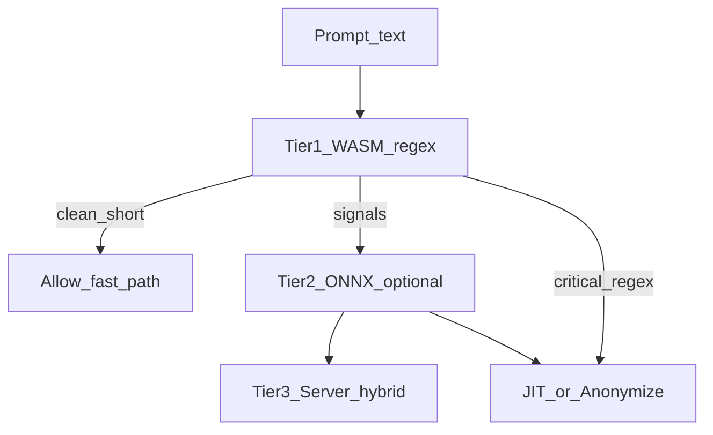

# Feature 04 — Local WebGPU / WebAssembly AI Auditing

## Part I — Deep explanation

### Problem statement

Many enterprises refuse: *"Send every employee prompt to our DLP vendor's cloud to see if it's safe."* That doubles data exposure.

**Local audit** runs classification **inside the browser** before anonymization and network. Raw text never leaves the machine for vetting (ingest to org server may still occur per policy).

### User story

> CISO enables "air-gapped client audit."  
> Employee types a prompt with embedded AWS key.  
> WASM regex flags CRITICAL in 4ms; optional ONNX model confirms "credential leak" in 28ms.  
> JIT gate fires; anonymization replaces key before any external request.

### Tiered audit pipeline



| Tier | Technology | Latency | Purpose |
|------|------------|---------|---------|
| 1 | Rust WASM / TS regex | &lt;5–15ms | Deterministic secrets, PII shapes |
| 2 | ONNX / transformers.js | 20–40ms | Semantic "confidential business intent" |
| 3 | Server [`dlp.py`](../../backend/services/dlp.py) | async | Audit record, alerts, custom org rules |

Tier 3 receives **redacted** text when anonymize enforced.

### WebGPU vs WASM fallback

```typescript
async function initAuditEngine(): Promise<AuditBackend> {
  if (navigator.gpu) {
    try {
      return await OnnxWebGpuSession.load('models/classifier.onnx');
    } catch {
      /* fall through */
    }
  }
  return await OnnxWasmSession.load('models/classifier.onnx');
}
```

**Conservative orgs:** Tier 1 only — no model download, &lt;500KB WASM.

### Model selection

| Model | Size (quantized) | Task |
|-------|------------------|------|
| `all-MiniLM-L6-v2` + linear head | ~25MB | Binary/multi-class risk |
| Custom ONNX from org | 5–15MB | Fine-tuned on internal policy examples |
| None | 0 | Regex port of DLP v2 |

Training pipeline (out of band): export ONNX → sign → host on AISentinel CDN or org VPC; extension verifies signature before load.

### Output schema

```typescript
interface ClientAuditResult {
  client_risk_score: number;       // 0-100
  client_risk_level: 'none' | 'low' | 'medium' | 'high' | 'critical';
  client_findings: Array<{
    type: string;
    severity: string;
    description: string;
  }>;
  client_model_version: string;    // e.g. "rules-2.0" or "onnx-1.0.3"
  client_timing_ms: number;
}
```

### Privacy guarantees (marketing-accurate)

| Statement | True when |
|-----------|-----------|
| "Prompt never sent to third-party ML vendor" | Tier 2 model bundled or org-hosted; no external API |
| "No cloud inference for audit" | `audit_mode: local_only` org setting |
| "Org still receives events" | Separate ingest path — redacted content only |

### Failure modes

| Failure | Behavior |
|---------|----------|
| WebGPU OOM | WASM CPU path |
| Model load timeout | Rules-only |
| False negative on novel phrasing | Server tier + human review |
| Model tampering | Signature check fail → refuse load |

---

## Part II — Implementation stack

| Option | Package | When |
|--------|---------|------|
| **A — Rules WASM** | `wasm-pack` + Rust | NF-2 ship target |
| **B — ONNX Web** | `onnxruntime-web` | NF-6 enterprise |
| **C — Transformers.js** | `@huggingface/transformers` | Rapid POC only |

### Recommended: Option A + optional B

```
extension/wasm/detect/     # Rust regex engine
extension/models/          # .onnx (gitignored, CI artifact)
extension/src/engine/audit.ts
```

### `chrome.offscreen` for heavy init (optional)

If model init &gt;100ms blocks content script:

```typescript
await chrome.offscreen.createDocument({
  url: 'offscreen.html',
  reasons: ['WORKERS'],
  justification: 'Load ONNX session',
});
```

### Align rules with server DLP v2

Port patterns from [`dlp.py`](../../backend/services/dlp.py):

- `OPENAI_KEY_RE`, `CONFIDENTIAL_PHRASES`, benign down-rank logic
- Single source of truth: generate TS/Rust from shared `patterns.yaml` (future build step)

### Latency budget (submit path)

| Component | p95 max |
|-----------|---------|
| Tier 1 WASM | 15ms |
| Tier 2 ONNX (if enabled) | 35ms |
| Combined | 45ms (within 50ms total pipeline) |

Skip Tier 2 when Tier 1 finds CRITICAL or prompt &lt;30 chars.

---

## Part III — Integration and optimization

### Files to add

```
extension/wasm/Cargo.toml
extension/src/engine/audit.ts
extension/src/engine/audit-rules.ts
extension/offscreen/offscreen.html
extension/offscreen/offscreen.ts
backend/services/hybrid_dlp.py
```

### Hybrid server merge

```python
# hybrid_dlp.py
def merge_client_server(client: ClientAuditPayload, server: ScanResult) -> ScanResult:
    score = max(client.client_risk_score, server.risk_score)
    level = _level_from_score(score, client.has_critical or server.has_critical)
    reasons = list(dict.fromkeys(client.risk_reasons + server.risk_reasons))[:10]
    return ScanResult(risk_score=score, risk_level=level, risk_reasons=reasons, ...)
```

### Ingest fields

```json
{
  "client_risk_score": 72,
  "client_risk_level": "high",
  "client_findings": [{ "type": "CONFIDENTIAL", "severity": "HIGH" }],
  "client_model_version": "rules-2.0",
  "client_timing_ms": 12
}
```

### Acceptance criteria (NF-2 gate)

- [ ] AWS key in prompt → client CRITICAL &lt;15ms (benchmark)
- [ ] Benign "weather today" → client `none`
- [ ] WebGPU unavailable → WASM path same result
- [ ] `local_only` org → no Tier 3 required for JIT decision
- [ ] Model signature fail → rules-only + admin alert

### Optimization

- [ ] Worker thread for ONNX (`new Worker`) — keep content script responsive
- [ ] Memoize audit result per prompt hash until text changes
- [ ] SharedArrayBuffer only if COOP/COEP allows (often skip in extensions)

### Rollback

`org.settings.features.local_audit = false` → server-only DLP (current MVP).

---

## Cross-references

- Server DLP: [`Plan/14_RISK_DETECTION_ENGINE.md`](../../../Plan/14_RISK_DETECTION_ENGINE.md)
- Tech stack: [06_TECH_STACK_AND_LANGUAGES.md](../06_TECH_STACK_AND_LANGUAGES.md)
- Anonymization trigger: [01_ANONYMIZATION_TOKENIZATION.md](./01_ANONYMIZATION_TOKENIZATION.md)
