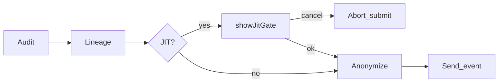

# Feature 05 — Just-In-Time (JIT) Micro-Training

## Part I — Deep explanation

### Problem statement

Hard blocks breed resentment. Most leaks are **negligent, not malicious** — employees do not recognize customer telemetry, internal codenames, or paste-from-ERP risk.

**JIT micro-training** inserts a **5-second contextual pause** at the moment of temptation: educate, attest, log — then allow (or anonymize) the action.

### User story

> Employee pastes Salesforce export into Claude.  
> Screen blurs; card asks: *"This looks like customer data from an internal CRM. Have you removed account names and IDs?"*  
> Checkbox: *"I confirm this data is approved for AI use."*  
> Employee continues; compliance log stores justification + timestamp.

### Trigger conditions

| Trigger | Condition | Default action |
|---------|-----------|----------------|
| Borderline client risk | `40 ≤ client_risk_score < 70` | Show JIT |
| Borderline server risk | Same on server pre-submit | Show JIT |
| Clipboard lineage | `internal_restricted` or higher | Show JIT |
| First shadow AI use | First submit on `unknown_ai` per 7 days | Show JIT |
| Org custom | Policy rule `require_jit_for: CUSTOM` | Show JIT |

**Do not trigger** when `client_risk_level === 'critical'` — skip straight to **enforce anonymize** or block per policy (no time to negotiate with API keys).

### Policy modes

| `jit_mode` | Behavior |
|----------|----------|
| `off` | No overlay |
| `log_only` | Show overlay but allow click-through without checkbox (analytics only) |
| `attest` | Require checkbox + optional reason text |
| `manager_notify` | Attest + email/webhook on repeat triggers within 24h |

### UX specification

```
┌─────────────────────────────────────────────┐
│  ⚠  Quick security check (5 sec)            │
│                                             │
│  This prompt may include customer telemetry │
│  from an internal system.                   │
│                                             │
│  ☐ I have removed PII and have approval     │
│                                             │
│  [ Cancel ]              [ Continue ]       │
└─────────────────────────────────────────────┘
```

- **Backdrop:** `backdrop-filter: blur(4px)` on full viewport
- **Shadow DOM:** isolated styles — no CSS leak from host page
- **Keyboard:** Escape = Cancel; Enter disabled until checkbox checked
- **Accessibility:** `role="dialog"`, `aria-modal="true"`, focus trap

### Compliance record

Stored on event (and searchable in dashboard):

```json
{
  "jit_decision": {
    "triggered": true,
    "trigger_reason": "clipboard_lineage:internal_restricted",
    "policy_version": "pol_v3",
    "user_acknowledged_at": "2026-05-23T12:01:00Z",
    "justification_text": "Approved for debugging ticket ENG-4421",
    "user_cancelled": false
  }
}
```

### Enterprise value

- **Audit trail** for regulators: who acknowledged what risk
- **Behavior change** via repetition — not annual training deck
- **Lower friction** than block — improves extension adoption

### Anti-patterns to avoid

| Bad | Good |
|-----|------|
| 30-second mandatory video | 5-second checkbox |
| Generic "policy violation" | Specific reason from audit/lineage |
| JIT on every message | Rate limit: max 3 per hour per tab |
| Block without override path | Manager escalation link (future) |

---

## Part II — Implementation stack

| Component | Technology |
|-----------|------------|
| Overlay UI | TypeScript + Shadow DOM (`ui/jit-overlay.ts`) |
| Styling | Encapsulated CSS string (no Tailwind in content script) |
| State | Promise-based `await showJitGate(options)` |
| Pipeline integration | `engine/pipeline.ts` awaits before anonymize/send |
| Backend | `jit_decision` on Event document |
| Dashboard | Events filter `has_jit_decision` |

### API

```typescript
interface JitGateOptions {
  title: string;
  body: string;
  checkboxLabel: string;
  requireReason?: boolean;
  policyVersion: string;
}

interface JitGateResult {
  acknowledged: boolean;
  justificationText?: string;
  cancelled: boolean;
}

async function showJitGate(opts: JitGateOptions): Promise<JitGateResult>;
```

### Latency

JIT UI is **user-paced** — not counted in 50ms hot path.  
Decision check (should we show JIT?) ≤2ms.

---

## Part III — Integration and optimization

### Pipeline placement



### Files to add

```
extension/src/ui/jit-overlay.ts
extension/src/ui/jit-styles.css          # inlined as string
extension/src/engine/jit-triggers.ts
backend/schemas.py                       # JitDecision model
frontend/src/pages/Events.jsx            # show jit_decision in modal
```

### Files to modify

| File | Change |
|------|--------|
| [`events.py`](../../backend/api/events.py) | Accept `jit_decision` on ingest |
| [`documents.py`](../../backend/models/documents.py) | `jit_decision: Optional[dict]` |
| [`Events.jsx`](../../frontend/src/pages/Events.jsx) | Render attestation in detail modal |

### Rate limiting

```typescript
const JIT_LIMIT_PER_HOUR = 3;
const key = `jit_count:${tabId}`;
```

Store count in `sessionStorage`; reset hourly.

### Acceptance criteria (NF-1 gate)

- [ ] Trigger on mock score 55 → overlay appears
- [ ] Cancel → no ingest, no AI submit
- [ ] Attest → ingest includes `jit_decision`
- [ ] `jit_mode: off` → zero UI change vs MVP
- [ ] Rate limit → 4th trigger in hour bypasses JIT with log flag `jit_rate_limited`
- [ ] Shadow DOM styles unaffected by ChatGPT dark mode CSS

### Optimization

- [ ] Pre-render overlay template once per page load (hidden)
- [ ] Reuse overlay element across triggers
- [ ] Do not blur entire DOM on low-end GPUs if `prefers-reduced-motion` — solid overlay instead

### Rollback

`org.settings.features.jit_training = false` — default for all orgs until pilot.

---

## Cross-references

- Vision: [00_VISION_AND_DIFFERENTIATION.md](../00_VISION_AND_DIFFERENTIATION.md)
- Lineage triggers: [02_CLIPBOARD_LINEAGE.md](./02_CLIPBOARD_LINEAGE.md)
- Client audit triggers: [04_LOCAL_WASM_WEBGPU_AUDIT.md](./04_LOCAL_WASM_WEBGPU_AUDIT.md)
- Integration phases: [07_INTEGRATION_MASTER_PLAN.md](../07_INTEGRATION_MASTER_PLAN.md)
