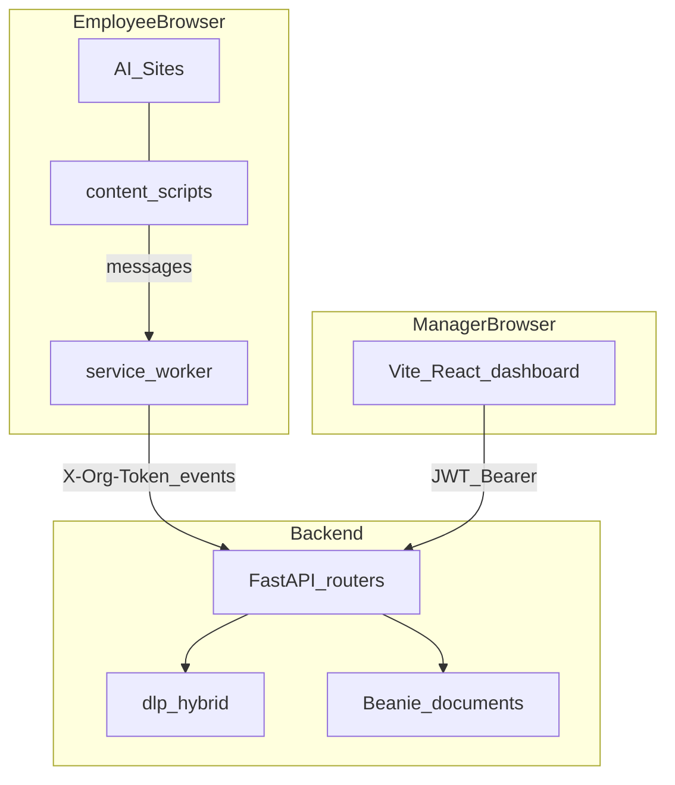

# Architecture

Product code lives under `aisentinel/`. This GitHub repo is named **aiextinct**.

## Components

| Component | Role |
|-----------|------|
| Chrome extension | Observe AI sites; capture prompts, activity, AI replies; poll enforcement |
| FastAPI backend | Auth, ingest, DLP scan, alerts, policies, enforcement queue |
| React dashboard | Admin login, events, alerts, settings, verify setup |
| Storage | `STORAGE_BACKEND=memory` (local demo) or MongoDB + Beanie |

## Boundaries

## Trust model (MVP)

- **Org token** (`X-Org-Token`): extension identifies the organization.
- **User token**: extension identifies which employee is monitored.
- **JWT**: dashboard users (admin / manager / employee roles).
- Extension is observe-only: it does not prevent ChatGPT from sending unless a future policy mode is enabled.

## Monitored surfaces

- ChatGPT (`chatgpt.com`, `chat.openai.com`)
- Claude (`claude.ai`)
- Gemini (`gemini.google.com`)
- Google Search (`google.com` / `www.google.com`) — search queries as events

## Related docs

- [DATA_FLOWS.md](DATA_FLOWS.md) — sequences
- [EXTENSION.md](EXTENSION.md) — MV3 details
- [BACKEND.md](BACKEND.md) — routers & models
- [Plan/03_TECHNICAL_ARCHITECTURE.md](../Plan/03_TECHNICAL_ARCHITECTURE.md) — full product architecture
