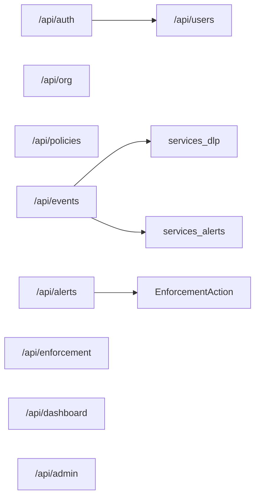

# Backend

FastAPI app: `aisentinel/backend/main.py`.

## Router map

| Prefix | Purpose |
|--------|---------|
| `/api/auth` | Signup / login / JWT |
| `/api/org` | Org settings, policies PUT |
| `/api/policies/cache` | Extension policy cache |
| `/api/events` | Ingest, get, status, **PATCH …/response** |
| `/api/alerts` | List + acknowledge (+ enforcement_action) |
| `/api/enforcement` | Extension pull / complete |
| `/api/dashboard` | Summary charts |
| `/api/admin` | Verify / ops helpers |

## Storage modes

| `STORAGE_BACKEND` | Behavior |
|-------------------|----------|
| `memory` (default local) | mongomock; seed demo org/users; data lost on restart |
| `mongodb` | Real Mongo via `MONGODB_URL` |

Models: `aisentinel/backend/models/documents.py` — `Organization`, `User`, `Event`, `Alert`, `DLPFinding`, `EnforcementAction`, …

## DLP

`services/dlp.py` — regex / heuristics / intent rules → `risk_level`, `risk_reasons`, findings.  
`services/hybrid_dlp.py` — merge optional client audit + lineage labels.

## Event fields teammates care about

- `prompt_text`, `activity_log`, `risk_*`
- `response_text`, `response_risk_level`, `response_risk_reasons`
- `client_submit_id` — idempotent ingest
- `jit_decision`, `clipboard_lineage` — advanced flags

OpenAPI live docs: http://localhost:8000/docs  
Spec: [Plan/06_API_SPEC.md](../Plan/06_API_SPEC.md)
