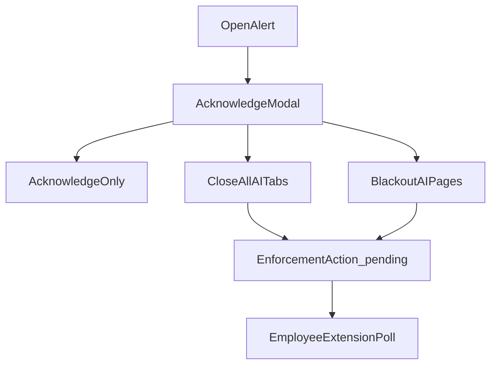

# Admin dashboard

React + Vite app: `aisentinel/frontend/`.

## Main pages

| Route / page | Purpose |
|--------------|---------|
| Login | JWT for admin@demo.com |
| Dashboard | Prompt counts, platforms, recent events |
| Events | List + detail: prompt, AI response, response risk, activity timeline |
| Alerts | Open / critical filters; **Acknowledge…** modal |
| Settings | Policies, feature flags, custom DLP patterns, domains |
| Admin Verify | Gate 4 — send test prompt without extension |

## Alerts → enforcement



HIGH/CRITICAL alerts offer close-tab and blackout. The action is queued for the **employee** tied to the alert (`user_id`). Their extension must use that employee’s user token.

Toast feedback confirms success or API errors (Acknowledge no longer appears to “do nothing”).

## Env

```powershell
$env:VITE_API_URL="http://localhost:8000"
npm run dev
```

Default port: **5173**.

## Related

- [DATA_FLOWS.md](DATA_FLOWS.md) — acknowledge sequence
- [Plan/19_ADMIN_VERIFY_DASHBOARD.md](../Plan/19_ADMIN_VERIFY_DASHBOARD.md)
