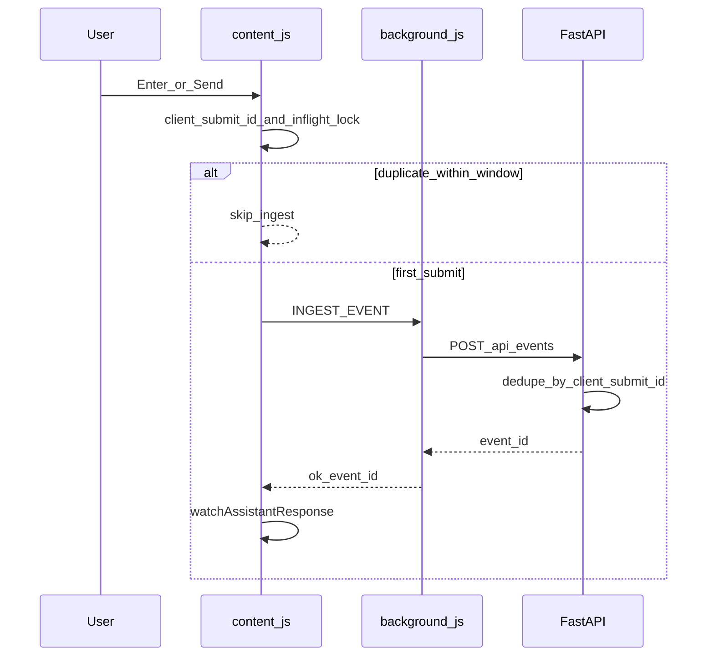
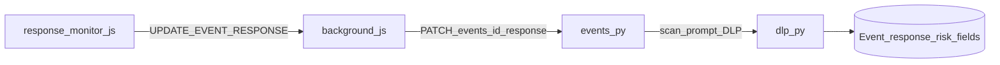
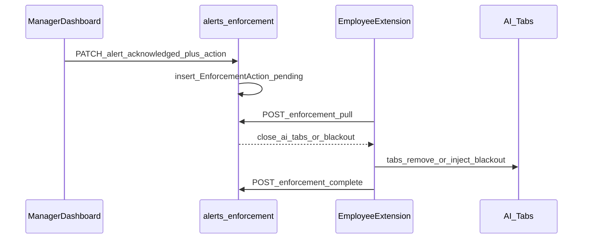

# Data flows

## 1. Prompt ingest (one real submit → one event)

Duplicate counting was caused by multiple Send-button listeners and race conditions. Current path uses a **single delegated** submit handler, `client_submit_id`, client lock/dedupe, and server-side dedupe.

**Key files**

- `aisentinel/extension/content.js` — capture + dedupe
- `aisentinel/extension/background.js` — `POST /api/events`, offline queue
- `aisentinel/backend/api/events.py` — ingest + `client_submit_id` lookup

---

## 2. AI response capture + company-data risk

After ingest returns `event_id`, the content script watches assistant DOM, debounces streaming text, and patches the same event. Backend reuses DLP scan on `response_text` and can raise overall event risk if the reply contains sensitive patterns.

---

## 3. Manager acknowledge → close tabs / blackout

**UI:** Alerts → **Acknowledge…** → Acknowledge only / Close all AI tabs / Blackout AI pages (for HIGH/CRITICAL).

**Polling:** extension alarm ~1 minute + opportunistic poll when content scripts load.

---

## 4. Activity log (not extra events)

Clicks, focus, paste, and submit are stored on the **same** event as `activity_log[]`. They must not create additional Event documents.
