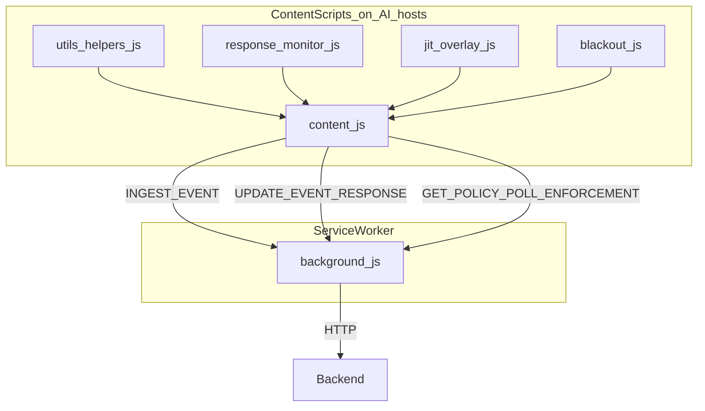

# Chrome extension

Manifest V3 vanilla JS under `aisentinel/extension/`.

## Script roles

| File | Responsibility |
|------|----------------|
| `manifest.json` | Matches ChatGPT, Claude, Gemini, Google; permissions `storage`, `alarms`, `tabs`, `scripting` |
| `utils/helpers.js` | Platform selectors + `resolvePlatformConfig` |
| `content.js` | Prompt capture, activity log, dedupe, start response watch |
| `engine/response-monitor.js` | Debounced assistant text → PATCH |
| `background.js` | Policy cache, ingest/retry queue, enforcement poll, close/blackout |
| `ui/blackout.js` / injected func | Full-page org pause overlay |
| `popup/` | API base + org/user tokens |

## Capture strategy (ChatGPT)

ChatGPT often clears the composer before click handlers read text. The extension:

1. Tracks `lastKnownPrompt` on `input` / paste
2. Captures on **mousedown** (delegated) before the page clears
3. Uses Enter (non-repeat) only when focus is in the composer
4. Dedupes with `client_submit_id` + in-flight lock

## Policies (feature flags)

`GET /api/policies/cache` (org token). Features default **off** in seed: JIT, local audit, anonymize suggest, clipboard lineage, shadow AI. Toggle in dashboard **Settings**.

## Reload after pull

Always **Reload** the unpacked extension after changing JS under `aisentinel/extension/`.
