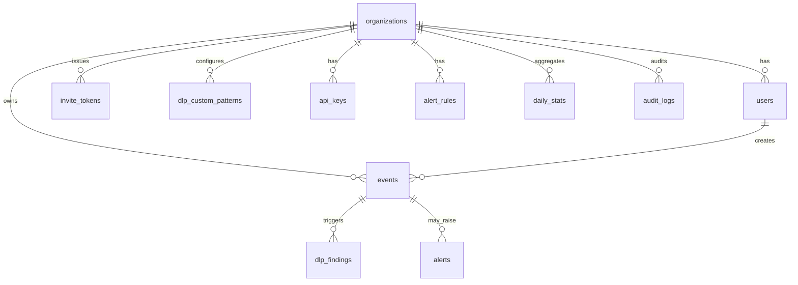

# 05b — MongoDB Schema (Canonical MVP)

## Executive summary

AISentinel stores organizations, users, AI usage events, DLP findings, and alerts in **MongoDB 7** using **Beanie ODM** on top of **Motor** (async). Redis handles sessions, rate limits, and cache. There is no Alembic; schema changes use versioned scripts in `backend/migrations/`. Prompt text has a **TTL index** (default 90 days). All API responses expose document IDs as strings (24-char hex ObjectIds).

---

## Scope

| In scope | Out of scope |
|----------|--------------|
| 10 collections + indexes | Sharding (Phase 2+) |
| Beanie document models | PostgreSQL / SQLAlchemy |
| Seed script for demo org | Multi-region replica sets (MVP: single node) |
| Aggregation pipelines for dashboard | Full-text search at scale (use `$text` MVP only) |

---

## Entity relationship



---

## Database configuration

| Setting | Value |
|---------|-------|
| Database name | `aisentinel` |
| Connection env | `MONGODB_URL=mongodb://mongo:27017/aisentinel` |
| ODM | Beanie 1.x + Motor |
| ID type | `PydanticObjectId` / `bson.ObjectId` |

---

## Collections reference

### `organizations`

| Field | Type | Required | Notes |
|-------|------|----------|-------|
| `_id` | ObjectId | auto | |
| `name` | string | yes | Display name |
| `slug` | string | yes | Unique, URL-safe |
| `org_api_key` | string | yes | Prefix `aisnl_org_`, unique |
| `plan` | string | yes | `free` \| `starter` \| `growth` \| `enterprise` |
| `settings` | object | no | See below |
| `created_at` | datetime | yes | UTC |
| `updated_at` | datetime | yes | UTC |

**`settings` object:**
```json
{
  "alert_email": "cto@company.com",
  "daily_digest": true,
  "retention_days": 90,
  "dlp_sensitivity": "medium",
  "notify_on_critical": true,
  "encrypt_prompts_at_rest": false
}
```

**Indexes:**
```javascript
db.organizations.createIndex({ slug: 1 }, { unique: true })
db.organizations.createIndex({ org_api_key: 1 }, { unique: true })
```

---

### `users`

| Field | Type | Required | Notes |
|-------|------|----------|-------|
| `_id` | ObjectId | auto | |
| `org_id` | ObjectId | yes | Ref organizations |
| `email` | string | yes | Unique per org |
| `name` | string | yes | |
| `hashed_password` | string | no | null for pending invites |
| `role` | string | yes | `admin` \| `manager` \| `employee` |
| `user_token` | string | yes | Prefix `aisnl_usr_`, unique |
| `status` | string | yes | `pending` \| `active` \| `suspended` |
| `last_active_at` | datetime | no | |
| `created_at` | datetime | yes | |
| `updated_at` | datetime | yes | |

**Indexes:**
```javascript
db.users.createIndex({ org_id: 1, email: 1 }, { unique: true })
db.users.createIndex({ user_token: 1 }, { unique: true })
db.users.createIndex({ org_id: 1, status: 1 })
```

---

### `events` (core)

| Field | Type | Required | Notes |
|-------|------|----------|-------|
| `_id` | ObjectId | auto | |
| `org_id` | ObjectId | yes | |
| `user_id` | ObjectId | no | |
| `source` | string | yes | `extension` \| `proxy` \| `api` |
| `platform` | string | yes | `chatgpt` \| `claude` \| `gemini` \| ... |
| `page_url` | string | no | |
| `prompt_text` | string | yes | TTL field |
| `prompt_length` | int | yes | |
| `prompt_tokens` | int | no | proxy only |
| `session_id` | string | no | |
| `response_text` | string | no | proxy only |
| `response_tokens` | int | no | |
| `model_used` | string | no | |
| `risk_score` | int | yes | 0–100, default 0 |
| `dlp_categories` | array[string] | no | |
| `has_critical` | bool | yes | default false |
| `scan_version` | string | yes | e.g. `1.0` |
| `status` | string | yes | `clean` \| `flagged` \| `reviewed` \| `blocked` |
| `captured_at` | datetime | yes | When user submitted |
| `processed_at` | datetime | yes | |
| `created_at` | datetime | yes | |

**Indexes:**
```javascript
db.events.createIndex({ org_id: 1, captured_at: -1 })
db.events.createIndex({ org_id: 1, user_id: 1, captured_at: -1 })
db.events.createIndex({ org_id: 1, risk_score: -1 })
db.events.createIndex({ org_id: 1, has_critical: 1 }, { partialFilterExpression: { has_critical: true } })
db.events.createIndex({ org_id: 1, platform: 1 })
// TTL: expire prompt documents after retention (use captured_at + org settings in app OR fixed 90d)
db.events.createIndex({ created_at: 1 }, { expireAfterSeconds: 7776000 }) // 90 days MVP default
db.events.createIndex({ prompt_text: "text" }, { default_language: "english", weights: { prompt_text: 1 } })
```

**Privacy:** Text index is admin-search only; UI should redact by default. Per-org retention overrides require migration job (Phase 2).

---

### `dlp_findings`

| Field | Type | Required |
|-------|------|----------|
| `_id` | ObjectId | auto |
| `event_id` | ObjectId | yes |
| `org_id` | ObjectId | yes |
| `finding_type` | string | yes |
| `severity` | string | yes |
| `offset_start` | int | no |
| `matched_length` | int | no |
| `redacted_value` | string | no |
| `created_at` | datetime | yes |

**Indexes:** `{ event_id: 1 }`, `{ org_id: 1, severity: 1 }`, `{ org_id: 1, finding_type: 1 }`

---

### `alerts`

| Field | Type | Required |
|-------|------|----------|
| `_id` | ObjectId | auto |
| `org_id` | ObjectId | yes |
| `event_id` | ObjectId | no |
| `user_id` | ObjectId | no |
| `alert_type` | string | yes |
| `severity` | string | yes |
| `title` | string | yes |
| `description` | string | no |
| `status` | string | yes | `open` \| `acknowledged` \| `resolved` \| `false_positive` |
| `acknowledged_by` | ObjectId | no |
| `acknowledged_at` | datetime | no |
| `notified_email` | bool | default false |
| `created_at` | datetime | yes |

**Indexes:** `{ org_id: 1, status: 1 }`, `{ org_id: 1, created_at: -1 }`, `{ org_id: 1, severity: 1 }`

---

### `invite_tokens`

| Field | Type | Required |
|-------|------|----------|
| `_id` | ObjectId | auto |
| `org_id` | ObjectId | yes |
| `email` | string | yes |
| `token` | string | yes | unique |
| `invited_by` | ObjectId | no |
| `role` | string | default `employee` |
| `expires_at` | datetime | yes |
| `used_at` | datetime | no |
| `created_at` | datetime | yes |

**Indexes:** `{ token: 1 }` unique, `{ org_id: 1 }`, TTL on `expires_at` for unused tokens

---

### `api_keys`, `dlp_custom_patterns`, `alert_rules`, `daily_stats`, `audit_logs`

Mirror fields from [`05_DATABASE_SCHEMA.md`](05_DATABASE_SCHEMA.md) tables, using `org_id: ObjectId` instead of UUID FKs. `daily_stats` uses compound unique `{ org_id, user_id, stat_date }`.

---

## Beanie models (`backend/models/`)

```python
from datetime import datetime
from typing import Optional, List
from beanie import Document, Indexed, PydanticObjectId
from pydantic import Field

class Organization(Document):
    name: str
    slug: Indexed(str, unique=True)
    org_api_key: Indexed(str, unique=True)
    plan: str = "free"
    settings: dict = Field(default_factory=dict)
    created_at: datetime = Field(default_factory=datetime.utcnow)
    updated_at: datetime = Field(default_factory=datetime.utcnow)

    class Settings:
        name = "organizations"

class User(Document):
    org_id: PydanticObjectId
    email: str
    name: str
    hashed_password: Optional[str] = None
    role: str = "employee"
    user_token: Indexed(str, unique=True)
    status: str = "pending"
    last_active_at: Optional[datetime] = None
    created_at: datetime = Field(default_factory=datetime.utcnow)
    updated_at: datetime = Field(default_factory=datetime.utcnow)

    class Settings:
        name = "users"
        indexes = [
            [("org_id", 1), ("email", 1)],  # unique compound via migration script
        ]

class Event(Document):
    org_id: PydanticObjectId
    user_id: Optional[PydanticObjectId] = None
    source: str
    platform: str
    page_url: Optional[str] = None
    prompt_text: str
    prompt_length: int
    risk_score: int = 0
    dlp_categories: List[str] = Field(default_factory=list)
    has_critical: bool = False
    status: str = "clean"
    captured_at: datetime
    processed_at: datetime = Field(default_factory=datetime.utcnow)
    created_at: datetime = Field(default_factory=datetime.utcnow)

    class Settings:
        name = "events"
```

Full models for `DLPFinding`, `Alert`, etc. follow the same pattern in `backend/models/documents.py`.

---

## Application startup (Beanie init)

```python
from motor.motor_asyncio import AsyncIOMotorClient
from beanie import init_beanie
from models.documents import Organization, User, Event, DLPFinding, Alert, ...

async def init_db():
    client = AsyncIOMotorClient(settings.MONGODB_URL)
    await init_beanie(
        database=client.aisentinel,
        document_models=[Organization, User, Event, DLPFinding, Alert, ...],
    )
```

---

## Migrations (no Alembic)

```
backend/migrations/
├── 001_initial_indexes.py
├── 002_ttl_events.py
└── README.md
```

Each script: idempotent `create_index` calls, runnable via `python -m migrations.run`.

---

## Seed script (`backend/scripts/seed.py`)

Creates:
- Org: `Demo Corp`, slug `democorp`, key `aisnl_org_demo123`
- Admin: `admin@demo.com` / `password`, token `aisnl_usr_admin123`
- Employee: `emp@demo.com`, token `aisnl_usr_emp456`

Run: `docker compose exec api python -m scripts.seed`

---

## Dashboard aggregation pipelines

### Usage over time (7d, by day)

```javascript
db.events.aggregate([
  { $match: { org_id: ObjectId("..."), captured_at: { $gte: ISODate("...") } } },
  { $group: {
      _id: { $dateToString: { format: "%Y-%m-%d", date: "$captured_at" } },
      prompts: { $sum: 1 },
      flagged: { $sum: { $cond: [{ $gt: ["$risk_score", 0] }, 1, 0] } },
      critical: { $sum: { $cond: ["$has_critical", 1, 0] } }
  }},
  { $sort: { _id: 1 } }
])
```

### Platform breakdown

```javascript
db.events.aggregate([
  { $match: { org_id: ObjectId("..."), captured_at: { $gte: ISODate("...") } } },
  { $group: { _id: "$platform", prompts: { $sum: 1 } } },
  { $sort: { prompts: -1 } }
])
```

---

## Redis key structure (unchanged from 05)

```
session:{user_id}:{jti}       → valid   TTL: token expiry
ratelimit:events:{org_id}     → count   TTL: 60s
cache:org:{org_id}            → JSON    TTL: 300s
cache:usertoken:{user_token}  → user_id TTL: 600s
ws:pending:{org_id}           → list
```

---

## API ID format

All JSON responses serialize `_id` as `"id": "674a1b2c3d4e5f6789012345"` (string). Clients must not assume UUID format.

---

## Acceptance criteria

- [ ] Beanie init registers all document models without error
- [ ] Seed creates org + 2 users; login returns JWT
- [ ] Event insert with compound index query &lt; 50ms at 1k docs
- [ ] TTL index configured on `events.created_at` (90d)
- [ ] Dashboard summary aggregation returns correct counts

---

## Agent instructions

- **Implementing DB layer:** Read this file only; ignore SQL in `05_DATABASE_SCHEMA.md` except field names.
- **Implementing analytics:** Use pipelines in this doc; do not load all events into memory.
- **Changing schema:** Add migration script + update this doc in same PR.

---

## Cross-links

- [`06_API_SPEC.md`](06_API_SPEC.md) — API contracts
- [`14_RISK_DETECTION_ENGINE.md`](14_RISK_DETECTION_ENGINE.md) — fields written to events/findings
- [`13_DEPLOYMENT_DOCKER.md`](13_DEPLOYMENT_DOCKER.md) — Mongo service in Compose
- [`17_IMPLEMENTATION_SEQUENCE.md`](17_IMPLEMENTATION_SEQUENCE.md) — Gate 1
