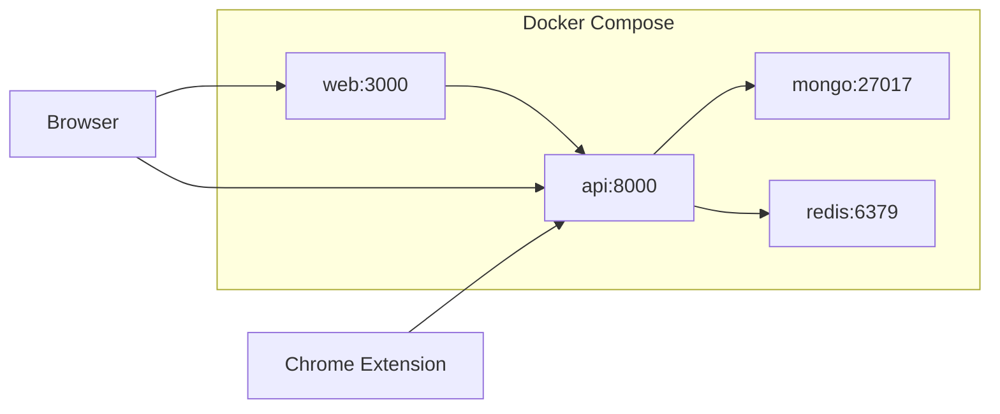

# 13 — Deployment (Docker Compose)

## Executive summary

AISentinel MVP runs entirely via **Docker Compose**: FastAPI API, React frontend (nginx), MongoDB 7, Redis 7. Healthchecks gate service startup. Local dev uses hot-reload volumes; production profile uses built images and stricter env. Optional Caddy sidecar for HTTPS in staging.

---

## Scope

| In scope | Out of scope |
|----------|--------------|
| `docker-compose.yml` + `.env.example` | AWS ECS/K8s (see `18`) |
| Healthchecks on all services | Multi-node Mongo replica set (MVP: single node) |
| Dev + prod Compose profiles | Managed Atlas (documented as upgrade path) |

---

## Service topology



---

## `docker-compose.yml` (canonical)

```yaml
version: "3.8"

services:
  api:
    build:
      context: ./aisentinel/backend
      dockerfile: Dockerfile
    ports:
      - "8000:8000"
    env_file: .env
    environment:
      MONGODB_URL: mongodb://mongo:27017/aisentinel
      REDIS_URL: redis://redis:6379/0
      JWT_SECRET: ${JWT_SECRET}
      FRONTEND_URL: http://localhost:3000
    depends_on:
      mongo:
        condition: service_healthy
      redis:
        condition: service_healthy
    healthcheck:
      test: ["CMD", "curl", "-f", "http://localhost:8000/health"]
      interval: 10s
      timeout: 5s
      retries: 5
    volumes:
      - ./aisentinel/backend:/app
    command: uvicorn main:app --host 0.0.0.0 --port 8000 --reload

  web:
    build:
      context: ./aisentinel/frontend
      dockerfile: Dockerfile
    ports:
      - "3000:80"
    environment:
      VITE_API_URL: http://localhost:8000
    depends_on:
      api:
        condition: service_healthy

  mongo:
    image: mongo:7
    ports:
      - "27017:27017"
    volumes:
      - mongodata:/data/db
    healthcheck:
      test: ["CMD", "mongosh", "--eval", "db.adminCommand('ping')"]
      interval: 10s
      timeout: 5s
      retries: 5

  redis:
    image: redis:7-alpine
    ports:
      - "6379:6379"
    healthcheck:
      test: ["CMD", "redis-cli", "ping"]
      interval: 5s
      timeout: 3s
      retries: 5

volumes:
  mongodata:
```

---

## `.env.example`

```env
JWT_SECRET=change-me-in-production-min-32-chars
MONGODB_URL=mongodb://mongo:27017/aisentinel
REDIS_URL=redis://redis:6379/0
FRONTEND_URL=http://localhost:3000
SMTP_HOST=
SMTP_PORT=587
SMTP_USER=
SMTP_PASS=
OPENAI_API_KEY=
ENV=development
```

---

## Backend Dockerfile

```dockerfile
FROM python:3.11-slim
WORKDIR /app
RUN apt-get update && apt-get install -y curl && rm -rf /var/lib/apt/lists/*
COPY requirements.txt .
RUN pip install --no-cache-dir -r requirements.txt
COPY . .
EXPOSE 8000
CMD ["uvicorn", "main:app", "--host", "0.0.0.0", "--port", "8000"]
```

---

## Frontend Dockerfile (production build)

```dockerfile
FROM node:20-alpine AS build
WORKDIR /app
COPY package*.json ./
RUN npm ci
COPY . .
ARG VITE_API_URL=http://localhost:8000
ENV VITE_API_URL=$VITE_API_URL
RUN npm run build

FROM nginx:alpine
COPY --from=build /app/dist /usr/share/nginx/html
COPY nginx.conf /etc/nginx/conf.d/default.conf
EXPOSE 80
```

---

## Commands

| Task | Command |
|------|---------|
| Start stack | `docker compose up --build` |
| Seed DB | `docker compose exec api python -m scripts.seed` |
| Logs | `docker compose logs -f api` |
| Tear down | `docker compose down` |
| Tear down + volumes | `docker compose down -v` |

---

## Health endpoints

| Endpoint | Expected |
|----------|----------|
| `GET /health` | `{"status":"ok"}` |
| `GET /api/admin/health/detailed` | Mongo + Redis latency (admin JWT) |

---

## Staging HTTPS (optional Caddy)

Add service `caddy` with `Caddyfile` reverse-proxy to `web:80` and `api:8000`. Use for demo servers only in MVP.

---

## Acceptance criteria

- [ ] `docker compose up` — all 4 services healthy within 60s
- [ ] `curl http://localhost:8000/health` returns 200
- [ ] `curl http://localhost:3000` serves React app
- [ ] Seed + login works against containerized Mongo

---

## Agent instructions

Implement Compose before any cloud deploy. Gate 0 in `17_IMPLEMENTATION_SEQUENCE.md` blocks on this file.

---

## Cross-links

- [`05b_MONGODB_SCHEMA.md`](05b_MONGODB_SCHEMA.md)
- [`10_DEVOPS_CI_CD.md`](10_DEVOPS_CI_CD.md)
- [`18_SCALING_STRATEGY.md`](18_SCALING_STRATEGY.md)
