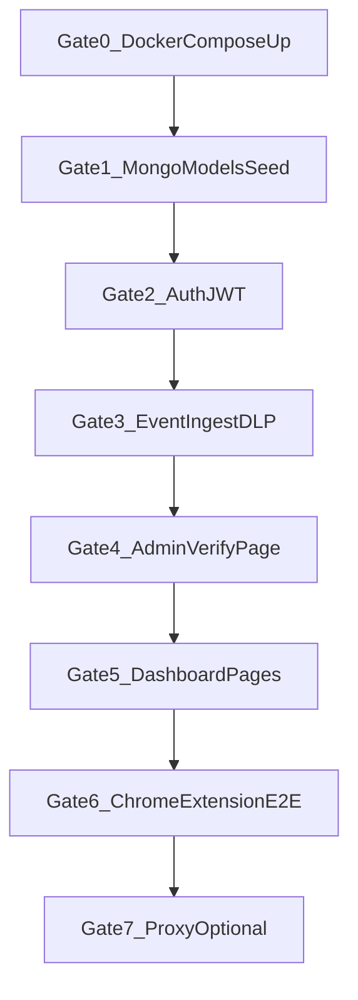

# 17 — Implementation Sequence (Gated)

## Executive summary

Build AISentinel in **8 gates**. Do not proceed until the current gate's acceptance criteria pass. This is the single execution order for implementation agents.

---

## Gate flow



---

## Gate 0 — Docker Compose up

**Read:** `13_DEPLOYMENT_DOCKER.md`, `16_REPOSITORY_STRUCTURE.md`

**Tasks:**
1. Create `aisentinel/` tree per `16`
2. Add `docker-compose.yml`, backend `Dockerfile`, stub `main.py` with `/health`
3. `docker compose up --build`

**Verify:**
```bash
curl -s http://localhost:8000/health
# {"status":"ok"}
```

**Rollback:** `docker compose down -v`

---

## Gate 1 — Mongo models + seed

**Read:** `05b_MONGODB_SCHEMA.md`

**Tasks:**
1. Beanie document models for all collections
2. `init_db()` on FastAPI startup
3. `scripts/seed.py`

**Verify:**
```bash
docker compose exec api python -m scripts.seed
docker compose exec mongo mongosh aisentinel --eval "db.users.countDocuments()"
# >= 2
```

---

## Gate 2 — Auth JWT

**Read:** `06_API_SPEC.md` (AUTH section), `11_SECURITY_SPEC.md`

**Tasks:**
1. `POST /api/auth/signup`, `login`, `GET /api/auth/me`
2. JWT middleware, bcrypt passwords
3. Generate `org_api_key` + `user_token` on signup

**Verify:**
```bash
curl -X POST http://localhost:8000/api/auth/signup -H "Content-Type: application/json" \
  -d '{"name":"Test","email":"t@test.com","password":"SecurePass123!","org_name":"TestCo"}'
# 201 + access_token
```

---

## Gate 3 — Event ingest + DLP

**Read:** `06_API_SPEC.md` (EVENTS), `14_RISK_DETECTION_ENGINE.md`

**Tasks:**
1. `services/dlp.py` with all rules
2. `POST /api/events` (extension auth via `X-Org-Token` + user_token in body)
3. Persist event + findings + alert if critical

**Verify:**
```bash
curl -X POST http://localhost:8000/api/events \
  -H "X-Org-Token: aisnl_org_demo123" \
  -H "Content-Type: application/json" \
  -d '{"user_token":"aisnl_usr_admin123","platform":"chatgpt","prompt_text":"key sk-test1234567890abcdef0123456789","prompt_length":50,"captured_at":"2026-05-23T10:00:00Z"}'
# risk_score > 80
```

---

## Gate 4 — Admin Verify page

**Read:** `19_ADMIN_VERIFY_DASHBOARD.md`, `07_FRONTEND_SPEC.md` (AdminVerify)

**Tasks:**
1. `GET /api/admin/health/detailed`
2. `POST /api/admin/verify/ingest-test`
3. `GET /api/admin/verify/dlp-fixtures`
4. React page `/admin/verify`

**Verify:** Admin login → Verify page → all greens + synthetic ingest pass

**Do not skip this gate.**

---

## Gate 5 — Dashboard pages

**Read:** `07_FRONTEND_SPEC.md`, `06_API_SPEC.md` (DASHBOARD)

**Tasks:** Login, Dashboard, Events, Alerts, Users, Settings

**Verify:** Dashboard summary returns non-mock data after Gate 3 events

---

## Gate 6 — Chrome extension E2E

**Read:** `08_CHROME_EXTENSION_SPEC.md`

**Tasks:** manifest, content, background, popup; configure tokens; submit on ChatGPT

**Verify:** Event appears in dashboard within 5s (manual checklist in `12`)

---

## Gate 7 — Proxy (optional)

**Read:** `03_TECHNICAL_ARCHITECTURE.md` (proxy section)

**Tasks:** `POST /proxy/openai/v1/chat/completions`

**Verify:** OpenAI SDK pointed at proxy logs event

---

## Handoff prompt (Phase B agent)

```
Read AGENTS.md and Plan/17_IMPLEMENTATION_SEQUENCE.md.
Start at Gate 0. Confirm each gate before advancing.
MongoDB not Postgres. Docker Compose only until 5 paying teams.
Pass Gate 4 before UI polish.
```

---

## Cross-links

- [`04_MVP_BUILD_PLAN.md`](04_MVP_BUILD_PLAN.md) — calendar weeks
- [`12_TESTING_STRATEGY.md`](12_TESTING_STRATEGY.md) — automated tests per gate
- [`AGENTIC_QUICKSTART.md`](AGENTIC_QUICKSTART.md) — step list
