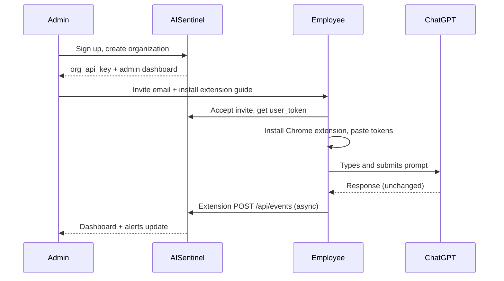

# 20 — Organization Employee AI Monitoring

## Executive summary

AISentinel is built for **companies that need visibility into how employees use ChatGPT, Claude, Gemini, and similar tools in the browser**. An organization admin deploys the Chrome extension to employee machines (or via managed Chrome policy); every prompt is attributed to an employee and visible in the admin dashboard.

---

## Who does what

| Actor | Responsibility |
|-------|----------------|
| **Organization admin** (CTO, IT, security) | Creates org, invites employees, reads dashboard, responds to DLP alerts |
| **Employee** | Installs extension, works normally on AI sites; usage is logged to org |
| **AISentinel backend** | Receives events, runs DLP, stores data per org |

---

## Deployment flow for an organization

### Step-by-step

1. **Admin signs up** at dashboard URL → organization `Acme Corp` created.
2. **Admin invites employees** (`POST /api/users/invite`) — each gets email + install link.
3. **Employee installs extension** from Chrome Web Store (or unpacked for pilot).
4. **Employee configures tokens** in extension popup: org key + personal user token (ties events to identity).
5. **Employee uses ChatGPT/Claude/Gemini** as usual — extension captures prompt text + metadata on submit.
6. **Admin monitors** on Dashboard, Events, Alerts, and **Admin Verify** pages.

---

## What is monitored (MVP)

| Captured | Not captured (MVP) |
|----------|-------------------|
| Prompt text sent to AI site | Full AI response text (browser limitation) |
| Which AI site (ChatGPT, Claude, etc.) | Non-AI browsing history |
| Timestamp, session id | Keystrokes before submit |
| Employee user_id (via token) | Screenshots |
| DLP risk score | Microphone/camera |

---

## What admins see per employee

- **Usage today / 7d / 30d** — prompt counts per person
- **Which tools** — ChatGPT vs Claude vs Gemini breakdown
- **Risk events** — API keys, emails, secrets in prompts
- **Event log** — searchable prompt preview (redacted in UI)

---

## Legal and HR requirements

Organizations **must**:
- Update acceptable-use / AI policy to disclose monitoring
- Inform employees before rollout (email + policy ack recommended)
- Limit admin access to authorized personnel
- Configure retention (`settings.retention_days`, default 90)

AISentinel provides technical capability; **compliance is the customer's responsibility**.

---

## Managed Chrome deployment (enterprise)

For IT teams distributing extension to all employees:

1. Package extension as `.crx` or use Chrome Web Store private listing
2. Google Admin Console → Apps → Chrome → force-install by OU
3. Pre-configure tokens via managed storage policy (Phase 2) — MVP uses manual popup entry

---

## Chrome extension role (critical path)

The extension is the **only** way to monitor web UI usage (chat.openai.com, claude.ai, etc.). Without it, only API proxy traffic is visible.

See [`08_CHROME_EXTENSION_SPEC.md`](08_CHROME_EXTENSION_SPEC.md) for implementation.

---

## Acceptance criteria (org pilot)

- [ ] 5 employees with extension configured
- [ ] Admin sees each employee's prompts within 5 seconds
- [ ] Admin can filter events by user and platform
- [ ] DLP alert fires when employee pastes test API key
- [ ] Employees report no breakage on ChatGPT submit

---

## Cross-links

- [`02_PRODUCT_SPEC.md`](02_PRODUCT_SPEC.md)
- [`08_CHROME_EXTENSION_SPEC.md`](08_CHROME_EXTENSION_SPEC.md)
- [`19_ADMIN_VERIFY_DASHBOARD.md`](19_ADMIN_VERIFY_DASHBOARD.md)
- [`11_SECURITY_SPEC.md`](11_SECURITY_SPEC.md)
